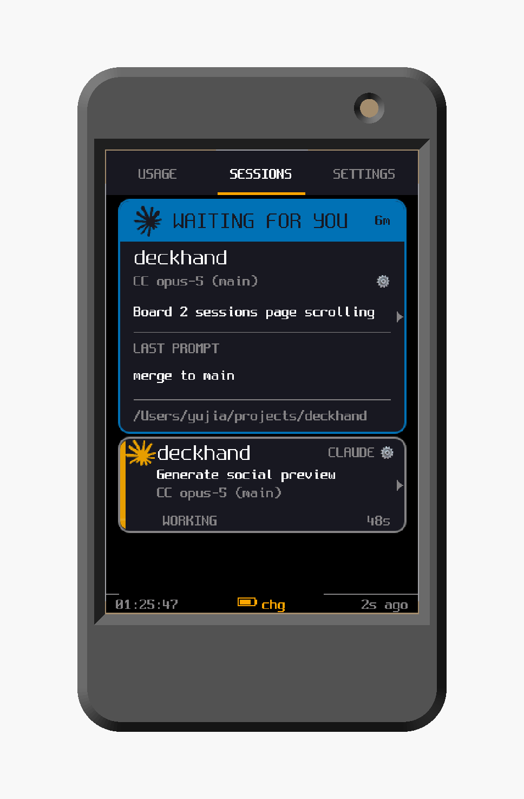
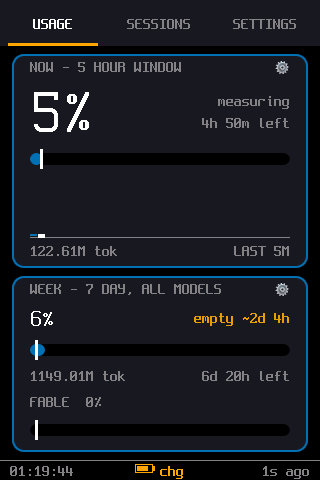
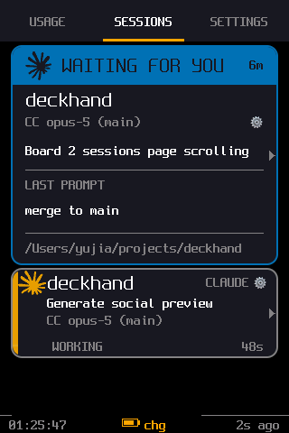
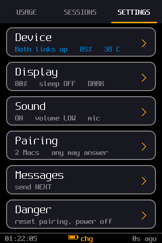
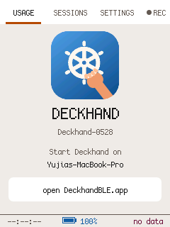

<p align="center"></p>

# Deckhand

<p align="center">
  
  <br>
  <em>The printable case from <code>case/</code>, with a real capture on its screen &mdash;
  rendered from the OpenSCAD model, not a mockup (<code>case/render-hero.py</code>).</em>
</p>

<p align="center">
  
  
  
  
  <br>
  <em>USAGE, SESSIONS, SETTINGS, and the standalone screen before the host connects -
  real captures read back off the panel, not mockups.
  <code>echo SCREENSHOT &gt; ~/.claude/deckhand-device-command</code> writes a PNG to
  <code>~/Deckhand-shots/</code>.</em>
</p>

[github.com/blueandhack/deckhand](https://github.com/blueandhack/deckhand) &middot; MIT

A little desk display and remote for Claude Code — the crew member who keeps
lookout and relays your orders. Built on an ELEGOO 2.8" ESP32 touchscreen
module, with optional battery and speaker. It shows live plan usage and
per-project session status, beeps when a session needs you, and shows permission
prompts, questions, and plan approvals so you can read *and* answer them from
across the room — tapping an option, or **speaking** the answer to a question if
the microphone is fitted — without taking the dialog away from your Mac. **Codex threads
appear in the same list** and, once Codex's own hooks trust prompt is accepted,
can be answered the same way; installs where that hasn't happened yet fall back
to a read-only view (see [Codex support](#codex-support)). Three tabs:

- **USAGE** — real plan-quota percentage for the current 5-hour session
  window and the current 7-day (weekly, all models) window. Each card has a
  reset countdown plus the wall-clock reset time ("at 14:32"), token counts,
  and a **pace tick** on the bar: a small white marker at the fraction of
  the window that has elapsed, so fill ahead of the tick = burning quota
  faster than time is passing. The weekly card also shows Fable's own
  weekly cap ("Fable: 9%"). Under the two cards, a single **CODEX** row
  carries Codex's own quota percentage, its reset countdown and wall-clock
  reset time, and **its own pace bar with the same pace tick** — Codex
  publishes enough (a reset time and a window length) to work out how much
  of the window has elapsed, so it reads exactly like the cards above it.
  It stays a row rather than a card because it has no token count and no
  second window, which would leave a card half empty. It reads `--`, never
  `0%`, until a rate-limit record has actually been seen: 0% is a
  measurement, and "never measured" is not.
- **SESSIONS** — which Claude Code and Codex projects are currently running
  on this Mac and whether each needs you. Rows stretch to fill the screen when
  you're monitoring only a few projects. Status is a pill whose weight
  matches urgency: solid **NEEDS INPUT** (permission prompt, question, or
  plan approval — Claude is blocked on you), outlined **READY** (turn
  finished), boxless dim **WORKING** (no attention needed). A project name too
  long for the big font **shrinks one step so you see it whole** rather than
  being cut off (up to 22 characters), and the space it has is measured against
  whatever else is on that row, not assumed. With **1-3 sessions on screen** the
  rows are tall enough to also carry the **session title** — Claude Code's own
  generated title, or one you set yourself, which takes precedence ("Refactor
  task modal logic", "Build Docker image version fetcher"). With 4 or more there
  isn't room and the title is dropped rather than squeezed. Codex rows don't show
  one. Each row shows
  model + git branch and a live "in this state for 3m" duration, and is
  tagged `CC` or `CX` (spelled `CLAUDE` / `CODEX` on tall rows) so the two
  tools are told apart by text rather than by colour or an icon. Both go
  into one list and one urgency ranking, so a mixed set sorts by how much it
  needs you rather than by which tool it came from. With more
  sessions than fit, the six most urgent are shown and a "+N more" strip
  admits to the rest (a hidden needs-input session is called out loudly).
  Tap a row for a detail screen showing the project, its title, the status
  with both how long ("for 12m") and when ("14:31"), **the last thing you
  asked it**, the path, and model / branch / start time / agent in paired
  columns — and **if the session is waiting on a prompt, that screen is an
  answer screen** instead: see below.
- **SETTINGS** — paginated (tap the `‹` / `›` pager), four pages:
  **STATUS** (Bluetooth/USB connection state — more trustworthy than macOS's
  Bluetooth panel — plus battery % / voltage and the device's pairing state),
  **DISPLAY & SOUND** (brightness, sleep-timeout, and speaker **volume**
  LOW/MED/HIGH steppers, plus sound on/off, NORMAL/FLIPPED screen-rotation, and a
  DARK / LIGHT / **AUTO** theme button sharing the bottom row), **ACTIONS** (MIC
  TEST, CALIBRATE TOUCH, RESET PAIRING, and POWER OFF in the alert color), and
  **PAIRED MACS** (every Mac the device remembers — tap one to restrict
  answering to it, tap the `x` to forget just that one). Every consequential
  action routes through a confirm dialog that states the consequence, not just
  the question. AUTO is a **clock**, not a light sensor — this board has no ADC
  channel left to put one on — so it runs LIGHT from 07:00 to 19:00 and DARK
  otherwise, keeping time from `millis()` when the Mac is away, and resolving to
  DARK when it has no clock at all (a full-white screen is the worse thing to
  guess wrong at 3am). Both themes are validated for text contrast and for
  colour-blind / greyscale separability of the status colours — consistent
  with status never being carried by colour alone elsewhere in the UI — and
  the choice persists across reboots.

A persistent footer on every tab shows a live clock, a battery pill
(fill level + `chg`/`full`/`%`), and "Xs ago" data freshness, so the
inherent polling delay is always visible rather than hidden. The battery reading
is coloured by level, but charging is treated as a *state* rather than a level —
8% while plugged in is not a warning, so it reads in the accent colour instead of
the alert one. The number, the glyph's fill and the words `chg`/`full` all say it
independently, so nothing there depends on seeing colour.

The device **double-beeps whenever a session transitions into "needs
input"** — the point of the whole build: you find out a session is blocked
on you without checking windows. It beeps at most 3 times per prompt (one
alert + two reminders 30s apart), then stays quiet even if the prompt sits
unanswered. Toggle sound with SOUND on the SETTINGS tab.

## Answering prompts from the device

When a session needs input, tapping its row opens a screen showing exactly
what's being asked:

- **Permission prompts** — "Allow Bash?" plus the actual command text ->
  Allow / Deny.
- **Questions (AskUserQuestion)** — the question and up to four options.
- **Plan approvals** — a plan summary -> Approve / Keep planning.

**Both surfaces are live at once, and the first answer wins.** The prompt appears
in Claude Code exactly as normal *and* on the device with working buttons — click
it on the Mac or tap it on the device, whichever is closer. Nothing is delayed
and nothing is hidden: answer on the Mac and the device just stops offering it.

**How long does a prompt stay answerable from the device? By default, until you
answer it — on either surface.** There's no countdown to beat: the Mac's dialog and
the device's buttons are both live from the first second, it's a race, and whichever
you use first wins. Answer on the Mac and the device just stops offering it.

If you want a deadline instead, put a number of seconds in
`~/.claude/deckhand-remote-wait`:

```
echo 90 > ~/.claude/deckhand-remote-wait     # the old behaviour: 90s, then Mac only
echo forever > ~/.claude/deckhand-remote-wait # the default (same as no file)
```

When a deadline is set, the device shows a countdown on the typing screen and stops
offering buttons when it lapses — the Mac's dialog is untouched and still waiting, so
you finish there. Nothing is ever auto-decided by the deadline passing.

Two caveats. **"Forever" is really 24 hours**, because Claude Code kills a hook that
outlives its `timeout` in `settings.json`, and the hook is written to always bow out
first rather than be killed — the two numbers are a pair, so if you raise the wait past
a day you must raise that `timeout` too. And **Codex keeps a 15-second wait regardless**:
unlike Claude Code, it has never been measured whether its approval UI is shown
*concurrently* with the hook or waits behind it, and if it waits, a long timeout would
stall or deadlock every Codex prompt. That's also why typing isn't offered on Codex asks.

A session sitting at **READY** can also be sent a typed message: open its detail
screen and tap **TYPE** in the header. Be clear about what SEND does — with the
default delivery it **copies the text to your Mac and notifies you to paste it**,
because there is no way to inject a prompt into a live interactive session. Set
`DECKHAND_VOICE_DELIVERY=dispatch` and it instead runs `claude -p --resume` in that
session's directory, which is a second author on that conversation and halts on
anything needing permission. The same switch governs dictation, so the mic and the
keyboard always behave alike.

On the typed-answer keyboard, the empty text box shows the **question you are
answering** (the keyboard takes the whole screen, so the prompt is otherwise off
it), and **tapping the text box** pages the full prompt over the keys while
leaving your answer visible. **CAP** cycles off → one-shot → locked (`CAPS`), and
**holding DEL** repeats after half a second.

Turn off **Settings › Answer prompts on device** in the menu bar to make the device a
read-only mirror instead — it still shows every prompt (handy for reading a long
command from across the room), under an "ANSWER ON YOUR MAC" heading.

Anything with code — a command, or a question/plan that contains line breaks —
renders as a code block in the **Cozette** bitmap font (crisp at this panel's
resolution), with its indentation and line breaks preserved; plain single-line
prose renders in a larger proportional font.
(Tabs become spaces and ``` fences are stripped, but real newlines survive all
the way to the screen.) If the detail is long, a **READ ALL** button
(top-right, well clear of the decision buttons) opens a full-screen reader with
prev/next paging. Tapping an option fills it solid ("Allow — sent") and the
screen returns to the list once Claude moves on. If a session shows NEEDS INPUT
but its prompt isn't answerable here (it fired while the display was
disconnected, or the answer window has closed), the detail screen says "Answer
this one on your Mac".

How it works underneath: the session hook publishes the prompt details into a
per-session file, which the host forwards to the device, and then waits (up to 90
seconds) for an answer. Your tap travels over USB/BLE to the host, which verifies
it and writes an answer file; the hook wakes and emits a real hook decision
(allow/deny/approve, or the chosen option). The reason this doesn't delay or hide
anything on the Mac is *which* hook event it waits on — Claude Code shows its
permission dialog concurrently with that event, so waiting is a race rather than
an interception. If the Mac answers first the hook notices within a second and
gets out of the way. It only waits at all when a display is actually connected
(it checks a heartbeat the host refreshes every tick), so with the device
unplugged prompts behave exactly as stock, and an unanswered prompt just falls
through to the normal dialog with no side effects.

### Answering a question by speaking

The useful reply to an `AskUserQuestion` is often "none of those — do X instead",
and that isn't a button. With the microphone fitted, a question ask gains a
**SPEAK** control: tap it, say the answer, tap to stop. The Mac transcribes it
locally and sends the text back, the device **shows you what it heard**, and
**SEND / RE-RECORD / CANCEL** decide what happens to it. Nothing is sent until
you tap SEND.

**The confirm tap is the authorisation, not an extra step bolted on beside it.**
The device can't transcribe — the Mac does that — so instead of signing a blank
cheque when recording starts, it signs a hash of *the exact text it displayed*.
That one signature proves two things at once: your paired device authorised this,
and a human read these words. A mishearing can't get through unseen, and a
substituted transcript can't be signed. It matters: a dictation on this project
once turned "make sure there is no sensitive data" into "…and **some** sensitive
information", inverting half the instruction.

Recordings cap at 20 seconds here (against 120 for a dictation), because the
whole exchange — record, transfer, transcribe, read, confirm — has to fit inside
the 90 seconds the hook will wait. If the transcript is too long to fit on one
screen, the device says so and **withholds SEND** rather than offering to sign
text you can't see. Questions only: a permission prompt can only be *denied*, so
speaking "yes, go ahead" at one would deny the command with that as its reason,
and a spoken answer to a plan approval would be silently approved with the words
discarded. Those keep their buttons.

### Or by typing

If speaking isn't an option — no microphone fitted, or you'd rather not talk —
a question ask also offers **TYPE** next to SPEAK. TYPE runs full-width only
when the host hasn't marked the ask as voice-answerable at all (an older host
predating the SPEAK feature); the device has no way to detect whether a
microphone is actually wired up, so it can't be the thing deciding this - it's
purely a property of what the host sent. It opens a full-screen QWERTY
keyboard, with `CAP` and `DEL` in place of shift/backspace glyphs (Cozette,
the on-device font, doesn't have those two characters — it's ASCII only).
Text is capped at 150 characters, with a running byte counter and a countdown
of the seconds left to answer, both shown above the text you're typing.

If the countdown runs out or the prompt is answered on the Mac while you're
still typing, the keyboard doesn't throw your text away: it stays on screen
with SEND withheld and a note that the window closed, so at worst you have to
retype it, rather than losing it silently mid-sentence.

TYPE is questions-only, for the same reason SPEAK is: a permission prompt can
only be denied, and a plan approval would silently discard the text and
approve. It's also not offered on Codex threads — Codex's answer window is
only 15 seconds (against 90 for Claude Code), which isn't enough time to type
a reply, so the button simply doesn't appear there rather than offering
something that can't finish in time.

## Codex support

Codex threads show up in the same SESSIONS list. Since 0.147.0, Codex CLI ships
a hooks system Deckhand can push through, the same way Claude Code state
*arrives* — a hook invoked on every event. Where that isn't available yet (the
hooks trust prompt hasn't been accepted, or the Codex version predates hooks),
the host falls back to **reading Codex's own files** — the per-thread rollout
JSONL under `~/.codex/sessions/YYYY/MM/DD/`, for the working directory, model,
task start/finish events, and quota.

Two consequences are worth knowing before you rely on it:

- **Codex threads now push their own state, and can be answered from the
  device.** `./install.sh` registers Deckhand's hook with Codex CLI
  (0.147.0+) in `~/.codex/hooks.json` — the same script that serves Claude
  Code, invoked with `--agent=codex` so it knows which tool called it. Once
  registered, start Codex and accept **"Trust all and continue"** on its
  hooks review prompt; hooks do nothing until you do, and editing them
  (including a Deckhand upgrade) asks again. After that, a Codex thread
  waiting on a permission prompt shows NEEDS INPUT exactly like a Claude Code
  session. Ending a thread removes its pushed record at once — but the
  rollout-derived fallback row for that same thread still ages out on its own
  over ~20 minutes, so an ended Codex thread can still linger on screen until
  then.
  The file-reading approach described above **remains as a fallback**, for
  Codex installs where the hooks trust prompt hasn't been accepted yet (or
  Codex versions that predate hooks): it still shows WORKING/READY from the
  rollout files, just without NEEDS INPUT or answering. The host merges a
  pushed and a pulled record for the same thread into one row rather than
  showing it twice.
  One thing about this is still unverified: what happens if a permission
  hook's wait (90s) is somehow exceeded rather than answered in time — whether
  Codex falls through to its own prompt (safe) or treats it as a denial. This
  can't be tested outside Codex's interactive TUI (`codex exec` always
  bypasses permissions), so it hasn't been. In practice the hook exits well
  inside its 100s timeout budget, so this only matters for a pathological
  overrun, not ordinary use.
- **Codex quota is one number**, read from whatever `rate_limits` record was
  seen most recently. There's no endpoint to ask (unlike the Claude side's
  OAuth poller), so if Codex stops running the number stops being updated — the
  device dims it past 15 minutes for the same reason stale Claude quota is
  flagged. A value read from a file that stopped being written is not a live
  reading.

Threads Codex spawns for itself (auto-review, guardian) are skipped: nobody is
waiting on those, and they'd crowd the six-row list.

## Talking to a session (speech-to-text)

With the microphone fitted you can dictate to a session: open its detail screen,
tap **`• REC`** in the tab bar, speak, tap again to stop. Up to 120 seconds.
(To *answer a pending question* by voice instead, see
[Answering a question by speaking](#answering-a-question-by-speaking) — that path
shows you the transcript and waits for a confirming tap before anything is sent.)

While the Mac works on it, the recording bar stays up showing **PROCESSING** with
elapsed seconds and a moving indicator, then **TRANSCRIBING** once the Mac confirms
it has started. If it never reaches TRANSCRIBING, the capture never arrived. Any tap
dismisses it, and it says so rather than spinning if nothing comes back.

**Transcription is local and free.** The host decodes the capture and runs
[whisper.cpp](https://github.com/ggerganov/whisper.cpp) on Metal —
`ggml-large-v3-turbo-q5_0` transcribes ~40x faster than realtime. Nothing is
uploaded, there is no API cost, and **the audio never leaves the machine**, which
matters for a microphone sitting on a desk all day. A vocabulary prompt primes the
decoder with this project's nouns, because without it "update CLAUDE.md" came back
as "update core code MD5".

**What happens to the transcript: it goes to your clipboard, plus a notification
naming the project to paste into.** The device card reads `COPIED - PASTE IT`. You
paste it into the session yourself.

That is deliberate. The original version ran it for you
(`claude -p --resume <session>`), and the first real use produced three problems at
once: the headless run became a **second author** appending to the same conversation
concurrently, nothing needing permission could finish (a headless run doesn't raise
permission prompts, so it can't be approved from the device either), and a mis-heard
word went straight to work — "make sure there is no sensitive data and **some**
sensitive information" inverted half the instruction. Handing it over costs
hands-free operation and fixes all three: it arrives as an ordinary message, in one
voice, with permissions behaving normally, and you get to read it first.

Set `DECKHAND_VOICE_DELIVERY=dispatch` if you want the old headless behaviour.
Recording from a *tab* rather than a session's detail screen keeps the transcript as
a memo and delivers nothing.

To decode and transcribe a capture by hand:

```
host/mic-stt.sh              # newest capture -> SNR + transcript
node host/mic-wav.mjs        # just the WAV, plus before/after noise figures
```

Both refuse a capture under 98% complete: truncation makes the audio decode as
garbage, which Whisper will happily transcribe into confident words nobody said.

## Security of the remote

Because the device can approve tool calls, the answer channel is
authenticated so that **only your paired Mac can make a decision** — a
stranger in Bluetooth range can't approve your prompts.

- **Unique name.** Each board advertises `Deckhand-XXXX` (from its MAC), so
  several units in one room don't collide, and your host connects only to
  the specific device it learned about over USB.
- **Signed answers.** The host and device share a 128-bit secret, generated
  by the host and pushed to the device **once over the trusted USB cable**
  (never over BLE). Every answer carries an HMAC over a per-prompt nonce the
  host issues, so a device that doesn't hold the secret can't forge an
  approval, and answers can't be replayed. Forged/unauthenticated answers
  are logged and dropped. The SETTINGS tab shows `paired` (secret provisioned)
  or `unpaired`.
- **One-time USB step.** Provisioning happens automatically whenever the
  device is on USB (which it is while flashing). A device that has only ever
  seen BLE can't be trusted to answer until you connect it via USB once.
- **Scope:** this protects the *decision* (integrity), not the
  confidentiality of the display data — the BLE link itself is unencrypted,
  so an eavesdropper in range could still read your session list and the
  prompt text. If that matters, use USB for the sensitive sessions. Full
  link encryption would need BLE bonding, which macOS + noble supports
  poorly (the reason this uses application-layer auth instead).

The secret lives in `~/.claude/deckhand-secret` (mode 600, machine-local,
never committed). Delete it to re-pair; the host regenerates one and
re-provisions over USB.

**Switching pairs.** To move the device to a **different Mac**, just plug it
into that Mac over USB with the host running — it re-pairs automatically (the
device announces its name, the new Mac provisions its own secret). To point a
Mac at a **different device**, connect the new device over USB. Two explicit
controls make switching clean:

- **Device › SETTINGS › ACTIONS › RESET PAIRING** wipes the device's stored
  secret so it reads `unpaired` and bonds fresh to the next Mac. Use it before
  handing the device to someone else.
- **Menu-bar app › Device › Forget device** drops the Mac's Bluetooth pin (it shows the
  paired device name too), so the Mac re-pairs to whatever device you next
  connect over USB.

Either way, re-pairing always needs a **USB connection once** — Bluetooth alone
can't provision (that's the security boundary).

**Two Macs at once.** One device can serve **two** Macs simultaneously over
Bluetooth, with sessions from both in the one urgency-ranked list. Setting up
the second Mac:

1. Install the host on the second Mac (`cd host && npm install`, then
   `./deckhand-service.sh install`) exactly as on the first.
2. **Connect the device to it over USB once, with the host running.** This is
   the whole pairing step — the Mac generates its own secret and pushes it with
   `PROVISION`, which is USB-only by design (BLE `PROVISION` is ignored, and
   that is the security boundary). The device stores it in its own slot, so the
   first Mac's key is untouched.
3. Unplug. Both Macs now hold their own key and talk to the device over BLE at
   the same time — each answers only its own prompts, and each signs with its
   own key.

The device remembers up to **4** Macs (`MAX_HOSTS`) but talks to **2** at a
time (`MAX_LINKS`) — a deliberate choice made well inside the Bluetooth
controller's own ceiling of **3** concurrent BLE connections
(`CONFIG_BTDM_CTRL_BLE_MAX_CONN`), not the controller's limit itself. A third
Mac trying to connect is refused, not queued.

While two Macs are connected, each session row and the detail screen carry a
short tag saying which Mac the session lives on (`CLAUDE/air`, `CC/studio`),
and the USAGE cards name the Mac whose quota reading they are showing. That tag
is derived from the Mac's hostname — its last segment, lowercased, capped at 6
characters — so `Yujias-MacBook-Air.local` becomes `air`. Set
`DECKHAND_MAC_TAG` in the host's environment to name a Mac yourself (it is
sanitised and capped to the same 6 characters, and is taken whole rather than
split on separators). With only one Mac connected the tag is omitted entirely,
since it would disambiguate nothing.

**Giving a Mac its own icon.** Each Mac can also carry a small 13x13 colour
icon, which the device draws on tall session rows, both USAGE cards, the Codex
row, SETTINGS › STATUS and the session detail card. Unlike the text tag, the
icon shows even with **one** Mac connected — a tag that disambiguates nothing is
noise, but an icon is yours.

Two ways to set it:

- **The menu-bar app**: Settings › **Mac icon**, and pick one. It takes effect on
  the device within a tick (~5s).
- **The environment**, which is the provisioning path — put it in the host's
  LaunchAgent plist so it survives reinstalls:

  ```xml
  <key>EnvironmentVariables</key>
  <dict>
    <key>DECKHAND_MAC_EMOJI</key>
    <string>rocket</string>
  </dict>
  ```

  (`launchctl unload`/`load` the job, or `./host/deckhand-service.sh stop` then
  `start`, for it to be read.)

The sixteen valid names:

```
rocket  moon     star     bolt
fire    leaf     wave     anchor
crab    laptop   desktop  cloud
sun     cat      apple    gear
```

**`DECKHAND_MAC_EMOJI` wins over the picker.** With a valid name in the
environment the menu's submenu reads *Mac icon (set by env)* and its entries are
disabled, rather than offering a checkmark that a click could not move. Unset it
if you want to choose from the menu again.

An **unknown name** (a typo, or a name from a newer host than the device's
firmware) sets no icon at all: the Mac drops it, and the device falls back to the
text tag described above. Nothing errors, so if an icon simply never appears,
check the spelling against the list first. `laptop` and `desktop` are the two
that are hard to tell apart at this size — they differ mainly in brightness — so
if both your Macs are computers, pick two shapes instead.

## Hardware

**There are two supported boards.** Board 1 is the one everything below defaults to and the one all
the optional add-ons are for. Board 2 is bigger, faster over USB, and does not have working audio
yet.

| | board 1 — the default | board 2 |
|---|---|---|
| what it is | ELEGOO **E32R28T** / E32N28T — 2.8" ESP32, 240x320 ILI9341 | LCDwiki **ES3C35P** — 3.5" ESP32-S3, 320x480 ST77922 |
| touch | resistive, one-time 5-point calibration on first boot | capacitive, factory-aligned, no calibration |
| USB | CH340 serial, `/dev/cu.usbserial-*` | native USB, `/dev/cu.usbmodem*` |
| flash it | `./flash.sh` | `./flash.sh --board 2` |
| microphone | fits a MAX4466 module — dictation works | has a real I2S mic on board, **no software for it yet** |
| beeper | 1W speaker, needs-input beep | speaker present, **not driven yet** |
| auto-sleep | yes, wakes on a held touch | **no** — the chip cannot wake from deep sleep by touch, so it is disabled |
| screenshots | ~18s each | ~0.4s each |

Everything else is the same firmware and the same host: the same three tabs, the same session list,
the same remote answering, the same pairing. Board 2's layout is **re-derived** for 320x480 rather
than scaled up, so the extra pixels become more rows and more air — four sessions keep their titles
where board 1 loses them at four, and the keyboard's keys grow from 22x40 to 30x54.

The rest of this section is board 1.

| | part | what to buy |
|---|---|---|
| **Required** | Display board | [ELEGOO E32R28T / E32N28T](https://www.amazon.com/dp/B0FJQ6RK39) — 2.8" ESP32, 240x320 ILI9341, USB-C (2-pack) |
| Optional | Battery | [3.7V 3000mAh LiPo](https://www.amazon.com/dp/B08T6GT7DV) — JST 1.25, protection circuit (4-pack) |
| Optional | Speaker | [1W 8Ω mini speaker](https://www.amazon.com/dp/B0D7SC3ZFG) — JST-PH 1.25 (10-pack) |
| Optional | Microphone | [MAX4466 electret amp module](https://www.amazon.com/dp/B08N4FNFTR) — adjustable gain (6-pack) |
| Optional | Case | print it yourself — [`case/`](case/) |

*The exact parts this was built and tested with, not recommendations. Note the
multipacks. Listings go stale, so the specs below are what actually matter if an
ASIN has moved on.*

The board is a 240x320 ILI9341 LCD with an XPT2046 resistive touch panel, and
talks to the Mac over **USB (CH340 USB-serial) and/or BLE** — both are always enabled on the device
simultaneously, and the host script sends to whichever are currently
connected (it's normal and expected for both to be connected at once).
Pin mapping (LCD + touch + battery ADC + audio) is documented at the top
of `firmware/deckhand_display/deckhand_display.ino`.

Optional add-ons — the battery and speaker just plug in; the microphone needs
three wires:

- **Battery** — a 1S LiPo on the JST 1.25 battery connector (tested with a
  3000mAh cell, which is what the case is sized for). Charging and power switching are pure hardware: the
  board's TP4054 charges at ~290mA whenever USB-C is present, and a P-FET
  power path runs the module from the battery the moment USB is unplugged.
  The firmware reads the level through the board's divider on IO34 and
  shows it in the footer and on SETTINGS. Heads-up: there is no VBUS-sense
  pin, so a *data-less* wall charger displays as "on battery" even while
  the hardware is charging.
- **Speaker** — a 1W 8Ω mini speaker on the JP1 terminals, driven by the
  onboard FM8002E amplifier. Used for the needs-input beep. Volume is set on
  the device (SETTINGS → DISPLAY & SOUND → VOLUME: LOW/MED/HIGH); the levels
  are the `VOL_PRESETS` duty values in the firmware.

- **Microphone** — a MAX4466 electret amp module, for dictating to a session
  (see *Talking to a session*). Three wires to the board's 4-pin **Expand**
  connector:

  | module pad | goes to |
  |---|---|
  | `VCC` | **3.3 V — never 5 V** |
  | `GND` | GND |
  | `OUT` | **IO35** |

  `IO35` isn't a choice: touch takes ADC1's 32/33/36/39 and the battery divider
  takes 34, leaving it as the only free ADC1 channel — and ADC1 is mandatory
  because ADC2 is dead while Bluetooth is active. **Never power it from 5 V**
  even though the module accepts 2.4–5.5 V: IO35 is not 5 V tolerant. Identify
  3.3 V and GND from the header's silkscreen and *meter them before plugging in* —
  reverse polarity drags the 3.3 V rail and the board won't boot, which looks
  exactly like bricked firmware (dark screen, no serial, while esptool still
  answers).
  To check it, tap **SETTINGS → ACTIONS → MIC TEST** for a live level meter. A
  working module idles at **~1.65 V** (VCC/2); a reading pinned near 0 means `OUT`
  isn't connected or it has no power. Aim for a silent floor of ~100–150 on the
  gain trimmer.

Bluetooth is **BLE** (a custom GATT service, the Nordic UART Service
pattern), not classic Bluetooth SPP. SPP was tried first and abandoned:
macOS's classic-BT stack would silently accept writes into a connection
with no real over-the-air session, a failure mode that recurred even
after a full unpair/restart/re-pair. BLE is far more actively maintained
on macOS since it's what nearly all modern accessories use.

## Controls

- **Tabs**: tap USAGE / SESSIONS / SETTINGS in the top bar.
- **Session detail**: tap a session row. **`< Back`** (top row) returns to the
  list; tapping the card opens the **history reader** — what you asked, what
  Claude said, what it ran, what came back, and what you allowed or denied,
  pulled from the Mac on demand. A `CHAT`/`ALL` chip filters conversation vs
  commands, and you move with `< PREV`/`NEXT >`, the scrubber bar, or by tapping
  a row to read that entry in full.
- **Record button**: `• REC`, a fourth slot at the right end of the tab bar.
  **Tap** to start recording, tap again to stop. It is drawn as a tab — same font
  and same accent underline when active — because pressed there means what active
  means on its neighbours; the leading dot is what says this one *does* something
  rather than going somewhere. See *Talking to a session*.
- **Brightness / sleep timeout / volume**: `-`/`+` steppers on SETTINGS. The
  whole left/right third of each card is a hit zone, which is much larger than
  the keys look, and the label sits between them so tapping it can't nudge the
  value. Sleep = backlight off after 15s–5m of no touch, or OFF to never sleep;
  any touch wakes it (that touch is consumed, so it won't also press whatever is
  underneath).
- **Sound**: SETTINGS toggle; turning it on plays the beep as a speaker test.
- **Power off**: tap **POWER OFF** on the SETTINGS tab, or hold the **BOOT** key
  ~1 second. This is ESP32 deep sleep
  (a true software power-off doesn't exist): screen, backlight, CPU, and
  radio all stop, dropping from ~100–150mA to a few mA — weeks of standby
  on battery instead of hours. **Touch the screen to turn it back on.**
  (Wake is deliberately touch, not the BOOT key — GPIO0 is a strapping
  pin, and waking with it held would boot into the serial bootloader.)
  The RESET key is always a hard power-on.
- **Auto power-off on battery**: if the device runs **on battery** with no
  active session for 20 minutes, it deep-sleeps by itself to save the
  battery (touch to wake) — the same power-down as holding BOOT. It **never**
  auto-sleeps while on USB power, no matter how long it's idle. Touch or any
  active session resets the 20-minute timer. (This is separate from, and
  goes further than, the SETTINGS "SLEEP AFTER" backlight dimming, which only
  turns the backlight off.)
- Settings (brightness, sleep, sound, touch calibration) persist across
  reboots and reflashes.

## Quick start (macOS)

You need: a Mac with [Node.js](https://nodejs.org) (`brew install node`),
[arduino-cli](https://arduino.github.io/arduino-cli/), Claude Code, and one of the
[two supported boards](#hardware).

```
git clone git@github.com:blueandhack/deckhand.git && cd deckhand
./install.sh
```

`install.sh` snapshots any existing Deckhand state to `~/Deckhand-backups`,
copies the Claude Code hook scripts into `~/.claude/`, registers them in
`settings.json` (backing yours up and merging - it won't clobber existing
hooks), runs `npm install`, and builds `DeckhandBLE.app` from your own Node.
Then two manual steps it prints for you: flash the firmware, and start the
host. **Restart Claude Code afterwards** so it picks up the new hooks. The
detailed walk-through is under [Setup](#setup) below.

## Screenshots

The device can photograph itself — no camera, no mockup:

```
echo "SCREENSHOT" > ~/.claude/deckhand-device-command
```

`TAB 0|1|2` and `PAGE 0..3` switch what is on screen first, so every tab can be
captured without standing at the device — the capture path can only ever record
what is currently on the glass.

It reads the panel back over SPI and ships it as base64 RGB565; the host rebuilds
it and writes a PNG to `~/Deckhand-shots/`. 240x320 is 153,600 bytes, so it takes
about 18 seconds at 115200. Nothing is blanked or redrawn while it runs, so what
lands on the Mac is exactly what was on the glass when the command arrived.

Two things this depends on, both measured rather than assumed:

- **The panel really can be read back.** The FAB note elsewhere says readback is
  unreliable here, which is a *speed* argument about per-pixel reads for
  transparency, not a correctness one. Four known colours written and read back on
  this wiring came back bit-identical at `SPI_READ_FREQUENCY 20000000`, and
  `readRect()` pulls a whole row per transaction.
- **`readRect()` returns pixels BYTE-SWAPPED**, where `readPixel()` does not:
  writing `0xF800` gives `readPixel=0xF800` but `readRect=0x00F8`. That is the same
  internal order sprites use, and the same trap the crab art hit with `pushImage`.
  The firmware undoes it before encoding, so the wire format is plain big-endian
  RGB565 and the decoder needs no endianness guess. Getting this wrong is not
  subtle but it is not obviously wrong either — the first capture looked like a
  perfectly good screenshot with purple text.

## Backing out (uninstall and restore)

```
./uninstall.sh --dry-run      # print exactly what would happen, change nothing
./uninstall.sh                # confirm, then remove
./uninstall.sh --purge        # ...and forget the device pairing keys too
```

It takes a snapshot before it removes anything, so the uninstall itself is
undoable, and it **un-registers surgically** — it deletes only the entries whose
command is Deckhand's, so any hooks or settings you added since installing
survive. What it deliberately keeps: your **pairing keys** (unless `--purge`,
since losing them means re-pairing every device over USB), `~/Deckhand-backups`,
`~/Deckhand-audio`, and this repo's build artifacts. It prints the command for
those last ones rather than reaching into your working tree.

State that lives outside the repo — the two hook scripts, your `settings.json`,
the pairing keys, and `~/.codex/config.toml` — is managed separately:

```
node claude-hooks/deckhand-backup.mjs backup            # snapshot -> ~/Deckhand-backups
node claude-hooks/deckhand-backup.mjs status            # drift: installed vs repo vs backup
node claude-hooks/deckhand-backup.mjs restore latest --dry-run
node claude-hooks/deckhand-backup.mjs restore latest
```

Snapshots go to `~/Deckhand-backups` (directory `700`, the key file `600`) and
**never into the repo**, which is tracked by git and could be pushed. A restore
snapshots what's currently installed first, so a wrong restore is one more
restore away from being undone. The directory is capped the way audio captures
are — the newest 10 always survive, anything older than 30 days is pruned, and
what got removed is printed rather than dropped silently.

Because these scripts mutate `~/.claude`, which every Claude Code session on the
machine shares, they have a real test: `claude-hooks/test-install-cycle.sh` runs
the whole install → uninstall → restore cycle against a throwaway `$HOME`.

## Project layout

```
firmware/deckhand_display/*.ino           Arduino sketch, several files, one build
firmware/deckhand_display/board.h         picks the board from the compile target
firmware/deckhand_display/board_*.h       per-board pins, capabilities and EVERY layout constant
firmware/deckhand_display/panel_*.{h,cpp} board 2's TFT_eSPI-compatible shim + framebuffer
firmware/deckhand_display/st77922_*       board 2's panel init sequence and touch controller
firmware/deckhand_display/*-geom-check.mjs  layout arithmetic checkers, both boards, no hardware
firmware/tft_setup/User_Setup.h           TFT_eSPI pin config - BOARD 1 ONLY
docs/board-1-known-defects.md             board-1 bugs the second-board port surfaced
host/index.mjs                            Node script (runs on your Mac)
host/typed-answer.mjs, voice-answer.mjs   answer crypto, pure + testable
host/build-app.sh                         builds DeckhandBLE.app from your node
host/DeckhandBLE.plist                    Info.plist template for that app
host/deckhand-service.sh                  launchd supervision (install/stop/status)
flash.sh                                  compile + flash, handles the serial port
claude-hooks/                             the ~/.claude hook scripts + installer
install.sh                                one-command setup
```

Runtime state, per user:

```
/tmp/deckhand-<uid>/host.log              the host's log (rotates at 5MB, keeps .1)
/tmp/deckhand-<uid>/host-alive            heartbeat; gates the hook's remote wait
~/.claude/deckhand-restarts.log           one line per host start (see Keeping it running)
~/Library/Logs/deckhand-launchd.{out,err} whatever dies before the host's own logger
```

The Claude Code hook scripts ship in `claude-hooks/` but *run* from
`~/.claude/` (hooks are configured per-user, not per-project); `install.sh`
puts them there. At runtime they use these per-user paths:

```
~/.claude/deckhand-statusline.mjs        statusLine hook -> ~/.claude/deckhand-rate-limits.json
~/.claude/deckhand-session-hook.mjs      session hooks   -> ~/.claude/deckhand-sessions/*.json
~/.claude/settings.json                  registers both of the above
```

## How it works

```
Claude Code hooks (any surface: terminal, desktop app, VS Code)
    |
    `-- hooks: SessionStart, UserPromptSubmit, PreToolUse, PermissionRequest,
        PostToolUse, PostToolUseFailure, Notification, Stop, SessionEnd
            -> ~/.claude/deckhand-session-hook.mjs -> ~/.claude/deckhand-sessions/<id>.json
               (for answerable prompts: publishes the question, then waits up
                to 90s for ~/.claude/deckhand-answers/<id>.json before falling
                back to the normal dialog)

host/index.mjs (device tick every 5s)
    - Anthropic OAuth usage endpoint (every 5 min)  -> real 5h/7d/Fable quota %
      (falls back to ~/.claude/deckhand-rate-limits.json, written by the
      statusLine hook, if the endpoint is unreachable)
    - ccusage blocks --active / weekly              -> token counts
    - ~/.claude/deckhand-sessions/*.json                -> per-project status + asks
    - writes /tmp/deckhand-<uid>/host-alive heartbeat (gates the hook's remote wait)
    -> JSON line over USB serial AND/OR BLE - both independent, always
       attempted; sends to whichever are currently connected
    <- "ANSWER <id> <prompt> <option>" lines from the device (USB rx or BLE
       notifications) -> ~/.claude/deckhand-answers/<id>.json for the hook

deckhand_display.ino (ESP32 or ESP32-S3 - one firmware, two boards)
    - parses each JSON line, redraws only the fields that changed
    - beeps (max 3x) when a session newly needs input          [board 1 only]
    - touchscreen for tabs/detail/answering; BOOT key for power off
    - board 2 draws into a PSRAM framebuffer and flushes dirty rectangles
```

**Quota numbers** come primarily from the same endpoint Claude Code's own
`/usage` screen uses, authenticated with the OAuth token Claude Code stores in
the macOS Keychain. This works with zero Claude sessions open and reflects
account-wide usage from every surface. The statusLine cache is kept as a
fallback since the endpoint is undocumented.

The host **does refresh that token** when it's expired or near expiry, writing
the rotated tokens back into the same Keychain item in place. That's necessary
rather than optional: the access token lives ~8h, and an always-on host can't
rely on a Claude Code surface being open to renew it — without this it just
sat there getting HTTP 401s. It only ever exchanges a still-valid refresh
token, and persists the rotated one (skipping that would break Claude Code's
own next refresh with `invalid_grant`). If the refresh is genuinely rejected
it says so and asks you to sign in again, rather than hammering the endpoint.

**Session status** works in every surface. The needs-input state is driven
by the `PermissionRequest` hook (fires when an allow/deny dialog appears)
plus `PreToolUse` for questions/plan approvals; the desktop app never
fires the `Notification` hook, which is why the older Notification-based
detection missed desktop permission prompts entirely.

## Setup

`./install.sh` does steps 3–5 for you; they're spelled out here for
reference and for the firmware, which is always hands-on.

1. **Prepare TFT_eSPI** — **board 1 only**; board 2 does not use TFT_eSPI at all. Copy this
   board's pin config into the library:
   ```
   cp firmware/tft_setup/User_Setup.h "$(arduino-cli config get directories.user)/libraries/TFT_eSPI/User_Setup.h"
   ```
   You also need the `esp32:esp32` core and the `TFT_eSPI`, `ArduinoJson`,
   and `XPT2046_Touchscreen` libraries (`Preferences` / `BLEDevice` /
   `BLEServer` / `BLEUtils` / `BLE2902` ship with the esp32 core). For **board 2** you need the
   same core plus `ArduinoJson` and **`ESP32_Display_Panel`** — and no `User_Setup.h`. BLE needs no
   extra library either way: the esp32 core's own `BLEDevice`/`BLEServer` headers are backed by
   Bluedroid on board 1 and by NimBLE on the S3, which the firmware handles.
2. **Flash the firmware** (from this directory):
   ```
   ./flash.sh                 # compile + upload BOARD 1 (the default)
   ./flash.sh --board 2       # compile + upload board 2
   ./flash.sh --no-compile    # upload the last build, skipping the ~3min compile
   ```
   One command on purpose. **Which board you are building for is decided entirely by that flag** —
   there is no switch to flip in the source, because a build that looks right and is wrong when
   someone forgets to flip it is worse than a longer command. It resolves the serial port (it renumbers between
   plug-ins), frees it, uploads, and puts the host back afterwards — including
   when the upload fails or you Ctrl-C, because leaving your display dead
   because a flash went wrong would be worse than the problem it solves. If the
   host is supervised (step 6) it stops the service properly rather than killing
   the process, which matters: `KeepAlive` re-grabs the port within a second of
   the process dying, so a bare `arduino-cli upload` fails on a busy port and
   looks like a hardware fault.
   `PartitionScheme=huge_app` gives the app partition 3MB instead of the
   default 1.2MB — needed because the Bluetooth stack alone is ~700KB+;
   this project doesn't use OTA or SPIFFS, so the tradeoff is free. On
   **first boot** the screen prompts for a one-time touch calibration —
   touch the five crosshairs (four corners and the centre); it's saved to
   flash and survives reflashing. **Board 2 skips that step**: its touch panel is capacitive and
   factory-aligned, so there is nothing to calibrate.

   **If board 2 goes mute — resets, enumerates, and emits nothing at any baud while `esptool`
   cannot sync — power-cycle it before suspecting the firmware.** Unplug it, or plug/unplug a
   battery, or hold **BOOT** while tapping **RESET** to force download mode. This has happened, and
   nothing software-side got it back: not four upload attempts, not all three `--before` modes on
   both `cu.` and `tty.`, not esptool's own DTR/RTS sequence by hand. **Enumeration proves
   nothing** on this board — it can appear as a healthy "USB JTAG/serial debug unit" and still be
   unreachable.
3. **Register the Claude Code hooks** — these feed per-session status (and
   the statusLine quota fallback). Without them the SESSIONS tab stays empty
   and remote answering is off.
   ```
   cp claude-hooks/deckhand-*.mjs ~/.claude/
   node claude-hooks/install-hooks.mjs   # backs up + merges into settings.json
   ```
   Then **restart Claude Code** so it reloads `settings.json`.
4. **Install host dependencies**: `cd host && npm install`.
5. **Build and run the host — via `DeckhandBLE.app`, not plain `node`, if you
   want Bluetooth**:
   ```
   host/build-app.sh            # builds the bundle from your node (one-time)
   open host/DeckhandBLE.app --args "$(pwd)/host/index.mjs"
   ```
   Launch it by hand **this once**: only a real app launch can raise the
   Bluetooth permission prompt. After you have clicked Allow, step 6 takes over.
   The bundle is required, not optional, for BLE — see
   [Why an app bundle?](#why-an-app-bundle) below. Click **Allow** the first
   time macOS asks for Bluetooth, and **Always Allow** if the Keychain asks
   about reading the Claude Code credential (that's the quota polling).
   No manual Bluetooth pairing is needed — the host scans for a device named
   "Deckhand" and connects directly.

   **Launch via the bundle even if you only want USB.** Plain
   `node host/index.mjs` does *not* work on current macOS: noble's
   CoreBluetooth init gets the process `SIGABRT`'d (exit 134) a second or two
   after startup, with the crash report blaming `TCC` — so there is no
   bare-node fallback, and USB doesn't survive it either. For a genuinely
   USB-only one-off job, write a throwaway script that imports **only**
   `serialport` and never touches noble; that survives, because nothing in it
   reaches CoreBluetooth.
6. **Let it run itself** — recommended, and what `install.sh` sets up for you:
   ```
   ./host/deckhand-service.sh install    # launchd, restarts on death, starts at login
   ./host/deckhand-service.sh status     # running? how often has it restarted?
   ```
   See [Keeping it running](#keeping-it-running).

### Keeping it running

The host is supervised by a launchd agent, because the failure it guards against
is one you cannot see. It has never crashed — it *hangs*, and when it does, its
serial reader keeps working, so device→Mac traffic still flows and everything
looks healthy while the display quietly goes stale. One stuck Bluetooth write
left it dead for five hours that way. With supervision, a death costs about a
second.

Two layers sit under that. Inside the host, a watchdog restarts the poll loop if
no tick completes for 30 seconds — because an `await` that never settles (rather
than failing) stops the loop permanently, and no amount of error handling catches
a hang. And every child process it spawns is bounded by a timeout, so a wedged
`ccusage` or a locked Keychain can't be the thing that stops it.

**Whether any of that is earning its keep is a question you can answer**, which
matters, because a safety net you can't see working is easy to trust wrongly.
Every start appends a line to `~/.claude/deckhand-restarts.log`, summarised by:

```
./host/deckhand-service.sh status
  starts total: 4    in the last 7 days: 1
  longest run: 41.2h    shortest: 12m
  last: … start #4 | previous run 41.2h, watchdog fires 0, ended: SIGTERM
```

Read it after a week. **"0 restarts, longest run 7d" means the net is unproven
*and unneeded*** — a perfectly good answer. A pile of restarts names what keeps
failing, which is a cause worth fixing rather than a net worth leaning on. The
column that matters is *last tick*, not duration: a run that lasted 5h whose last
tick was 4h before it ended didn't die, it **hung**, and those are marked
`STALLED`.

Runtime state lives in `/tmp/deckhand-<uid>/` — the log, the heartbeat, and the
quota throttle files — one directory per user, mode `0700`. That's per-user
because it has to be: on a shared Mac the second user's hook would otherwise read
the *first* user's heartbeat, decide a display was connected, and stall every
permission prompt for 90 seconds waiting for a device that isn't theirs.

To stop it, or to take the port back for something else:

```
./host/deckhand-service.sh stop     # and it stays stopped
./host/deckhand-service.sh start
./host/deckhand-service.sh uninstall
```

### Speech-to-text (only if you fitted the microphone)

```
./host/install-voice.sh
```

Idempotent, and it resumes a part-downloaded model rather than starting again. It
installs whisper.cpp and fetches the model — **two separate prerequisites**, which is
the whole reason this is a script. Brew deliberately ships no model, so installing
only the binary swaps `whisper-cli: ENOENT` for a nearly identical
`failed to load model`, and that reads like the install not having worked.

`install.sh` checks for both and tells you if they are missing; the host also says so
at startup (`Voice: DICTATION DISABLED - ...`) rather than accepting a recording,
spending the transfer, and only then failing. If you would rather do it by hand:

```
brew install whisper-cpp
mkdir -p ~/.cache/whisper.cpp && cd ~/.cache/whisper.cpp
curl -LO https://huggingface.co/ggerganov/whisper.cpp/resolve/main/ggml-large-v3-turbo-q5_0.bin
```
 Use
`large-v3-turbo-q5_0` (547MB) rather than `base.en` (141MB) — benchmarked on real
captures from this microphone, `base.en` turned "Update CLAUDE.md file" into
"update, CLAUDE and D5" and invented proper nouns, while turbo got it right and
still ran at ~40x realtime. Override with `WHISPER_MODEL` / `WHISPER_PROMPT`.

## Why an app bundle?

On macOS, a bare `node` process is **killed outright** — no permission
prompt, just an instant crash — the moment it touches Bluetooth, because it
has no `Info.plist` declaring `NSBluetoothAlwaysUsageDescription`.
`DeckhandBLE.app` is a minimal wrapper whose executable *is* a copy of your
`node` (plus any `libnode.*.dylib` it links), with an `Info.plist` that
declares the Bluetooth usage string — so macOS shows a normal permission
dialog instead of crashing. `host/build-app.sh` assembles it from your own
node, which is why the built bundle isn't committed to git (it's ~200MB and
machine-specific).

**Does the signature expire? Do I need to re-sign every 7 days?** No. The
bundle is **ad-hoc signed** (`codesign --sign -`), and ad-hoc signatures do
**not** expire — there is no clock on them. (The 7-day expiry you may be
thinking of applies to *free Apple Developer provisioning profiles* for
sideloaded **iOS** apps — a completely different mechanism that doesn't apply
here.) You only re-run `build-app.sh` when the bundle's contents actually
change: after `brew upgrade node` (to refresh the embedded copy), or if you
edit the plist. Nothing needs doing on a schedule.

Two things *do* invalidate a bundle and need a rebuild/re-sign, for
completeness: editing any file *inside* `DeckhandBLE.app` by hand (breaks the
seal), and — if you download the repo as a zip rather than `git clone` — the
macOS quarantine flag, cleared with
`xattr -dr com.apple.quarantine host/DeckhandBLE.app`.

## Menu-bar app (optional)

If you'd rather not touch the terminal, `mac-app/` is a tiny native
menu-bar controller (Swift, macOS 13+). Build and launch it:

```
mac-app/build.sh
open mac-app/DeckhandMenuBar.app
```

It puts an origami paper-boat icon in the menu bar. The dropdown is grouped:
where the host stands, what quota is left, who is waiting on you, the last
dictation, then the controls. The top level is **actions only** — **Start / Stop
Deckhand** and a **Device** submenu (which is also where **Forget** lives, since
it is a destructive per-device action) — while every preference sits behind
**Settings**: *Answer prompts on device*, *Colourful icon*, *Menu bar shows*,
*Needs-input sound*, *Mac icon* and *Launch at login*. *Mac icon* picks this Mac's
13x13 icon on the device (the sixteen names are listed under *Giving a Mac its
own icon*, in **Security of the remote**); with `DECKHAND_MAC_EMOJI` set it reads
*Mac icon (set by env)* and its entries are disabled, since a click could not
move that choice. Settings stays reachable with the host
stopped, since launch-at-login and the bar's own contents are still meaningful
choices then; Device and Answer-prompts dim with it, because neither can do
anything without the host.

```
● Syncing · USB + Bluetooth
   Deckhand-0528
──────────────────────────────
5h    ██░░░░░░░░   16% used
         resets in 2h 44m
7d    █░░░░░░░░░    2% used
         resets in 6d 21h
Codex ░░░░░░░░░░    0% used
──────────────────────────────
SESSIONS
■  deckhand  ·  needs input
●  api        ·  working
         Read the project
```

**Battery** appears under the device name — `78% · ~5h left` — and the hours are
measured, not modelled: the device watches its own voltage fall and says nothing
until that trend clears its ADC noise, roughly 20 minutes after you unplug. While
charging it says `charging`, and a reading older than three minutes is hidden
rather than shown as current. The same figure is on the device at
**SETTINGS › STATUS**, as `42% 3.85V ~5h`.

**Sessions come from the host's own tick line**, so they arrive already
urgency-sorted (needs-input first) and the menu can never disagree with the
device about which session matters most.

**Clicking a row jumps to the app that session lives in.** The hook stamps the
owning app into each session record — it inherits `__CFBundleIdentifier` and
`CLAUDE_CODE_ENTRYPOINT` from the Claude Code process that spawned it, so this
costs two environment reads and no searching. For an editor session it opens that
workspace, which brings the existing window forward; for a terminal or the desktop
app it just activates the app, since no API can focus one terminal tab and opening
the folder would spawn a new window; and when the app is unknown or no longer
running it reveals the folder in Finder, as this menu always did. That last check
matters — without it, clicking a stale row would *launch* an editor for a session
that is not in it any more. The row's tooltip names the model and git branch and
says exactly what the click will do, generated from the same resolver the click
uses so the two cannot disagree.

**The bar carries what the device would have shown, when the device is absent.**
Beside the boat, left to right: quota `5h·7d`, then the live sessions by status —
`■` needs input, `○` waiting on you, `●` working, one glyph per session, so the
three partition the list rather than overlapping. Each badge disappears at zero,
so an empty label is a quiet Mac and an absent `○` means "none waiting" rather
than "not shown". The two device-mirroring badges go quiet once a device is
connected — that is what *Menu bar shows › Only while no device is connected*
governs, and every part of it can be switched off there. The needs-input count is
not gated that way, because a prompt blocking your work is worth saying whether or
not the device is also saying it.

**A sound fires when a session starts needing input** — Submarine by default,
changeable (or silenceable) under *Needs-input sound*, where picking one plays it.
It sounds on the *edge* into needing input, keyed by session id, and the first
refresh after launch only primes: whatever was already waiting when the app
started is not news.

Quota rows say **when they are stale**, because the transport being fresh says
nothing about the numbers: the OAuth poller backs off 15 minutes on a rate limit
and can sit there for hours while every tick still arrives on time. Past 15
minutes — the same threshold the device dims its own big number at — the row dims
and appends `· stale 3h`, and the `high` / `critical` note is suppressed, since
97% from an hour ago is not a crisis to shout about but a number we cannot vouch
for. Each row carries the age of its own source, so a stale Codex reading cannot
drag the Claude rows down with it.

Quota says **"% used"** with the reset time in hours and days, and the bar plus
the words `high` / `critical` carry the same thing the orange and red do:
informational menu rows are disabled rows, which macOS may composite at reduced
alpha, so colour is never the only cue here — the same rule the device UI
follows.

Two flags let you inspect the menu without opening it by hand, which is
otherwise impossible to check:

```
DeckhandMenuBar --menu-dump                 # the real menu as text, incl. hidden/disabled state, tooltips
DeckhandMenuBar --menu-preview /tmp/m.png   # its actual styling, light and dark side by side
DeckhandMenuBar --open-session [id] [go]    # what clicking each session row would do; `go` does it
DeckhandMenuBar --sound-check [play]        # resolves every needs-input sound, and proves the edge logic
```

`--open-session` and `--sound-check` exist for the same reason as the two above: a
menu cannot be clicked from a script and a sound cannot be seen, so both paths are
otherwise only checkable by hand. Each prints by default and acts only when asked.

The icon is deliberately *not* the project's ship's wheel. The wheel is the
mark — it is on the device's waiting screen, in the hero image and in the app
bundle — and a mark carries identity, where a menu-bar glyph has to survive at
16px in one flat colour beside two dozen others. It is drawn from geometry
rather than shipped as a bitmap, so it stays crisp at any bar height on any
display.

It carries state as a **shape**: a solid boat when a device is connected, an
outlined one when none is. The icon stands for the *link*, not the process —
whether the host is running is said in words on the first row, where it cannot be
mistaken for anything else. It is drawn in the logo's mid-blue, which was chosen
by measurement rather than taste: it is the only colour from the mark that clears
the 3:1 contrast threshold against **both** a dark and a light menu bar (3.01 and
4.37), where the deep blue fails on dark, the light blue fails on light, and the
cream scores 1.00 — invisible — which is what ruled out a two-tone boat. Turning
*Colourful icon* off returns the monochrome template version, the only one that
follows light and dark bars by itself; a coloured icon also does not invert to
white while the menu is open, the way every other coloured menu-bar icon behaves.
To see it at every size without hunting for it in your menu bar:

```
mac-app/DeckhandMenuBar.app/Contents/MacOS/DeckhandMenuBar --icon-preview /tmp/icons.png
```

**If the LaunchAgent is installed, the app drives it** (`launchctl bootout` /
`bootstrap`) rather than killing the process — that is the only way Stop can mean
stopped, because `KeepAlive` undoes a plain kill within about a second. It also
skips its own watchdog in that case, since launchd already restarts a dead host and
survives reboots, and two supervisors that cannot see each other will fight over one
serial port. Without the agent it falls back to the old behaviour and keeps its
watchdog. The tooltip on Start/Stop says which mode you are in.
It doesn't touch Bluetooth itself — it just runs and watches the same
`DeckhandBLE.app` host — so the proven transport path is unchanged. The
built app embeds this machine's repo path, so re-run `build.sh` if you move
the repo. Ad-hoc signed; `SMAppService` may need the app in `/Applications`
to self-register as a login item.

## Known limitations

- **~5s delay**: the host polls every `POLL_INTERVAL_MS` (5000ms in
  `host/index.mjs`), plus whatever `ccusage`/`git` subprocess calls take.
  The footer's "Xs ago" makes this visible rather than hiding it. A
  permission prompt answered within a second or two may come and go
  between polls — the device is for prompts you *haven't* noticed.
- **The quota endpoint is undocumented** (it's what `/usage` uses); if it
  ever changes shape the host just falls back to the statusLine cache. It
  also rate-limits bursts — the host polls every 5 min and backs off 15
  min on HTTP 429. If the Mac goes weeks with no Claude Code use at all,
  the Keychain token can expire; opening any Claude Code surface once
  refreshes it.
- **Remote answering has a 90s window** per prompt (the hook can't wait
  forever), shows up to 1400 characters of detail (tap READ ALL for a
  full-screen reader with prev/next), and doesn't support multi-select
  questions. Question answers reach Claude as a "user already answered: X"
  hook message rather than a native picker selection — functionally
  equivalent. Answering is authenticated (see [Security](#security-of-the-remote));
  a device that hasn't been USB-provisioned with the pairing secret can't
  approve anything until you connect it via USB once.
- **Stale quota is flagged, not hidden**: if the quota numbers are older
  than 15 minutes (endpoint outage + stale cache), the USAGE cards show
  "stale 3h" in the alert color where the reset time normally sits.
- **Battery % is a voltage estimate** (no coulomb counter): it dips a few
  percent under heavy load and reads optimistic while charging. Charge
  state relies on USB *data* being present — a wall charger with no data
  shows "on battery" while silently charging fine.
- **"Off" is deep sleep**, a few mA, not a hard power cut — the CH340 and
  regulator stay powered. For true zero draw, unplug the battery. Because
  there's no VBUS-sense pin, "on USB power" is inferred from recent USB data,
  so a *data-less* wall charger counts as "on battery" for the 20-minute
  auto-sleep — plugged into your Mac (data flowing) it never auto-sleeps.
- **Touch calibration** is a 5-point least-squares *affine* fit (four corners
  plus the centre), so it corrects skew and rotation between the panel and the
  glass, not just scale and offset. It reports the worst residual at the
  targets and refuses to install a mapping from a nonsense set of taps, keeping
  the previous one instead. If it ever
  feels wrong after a firmware change, tap CALIBRATE on the SETTINGS tab, or
  send `RECAL` via the trigger file
  (`echo "RECAL" > ~/.claude/deckhand-device-command`) — never by opening a
  new USB connection, which resets the board via the CH340's RTS line.
- **`TOUCH_SWAP_XY`** in the `.ino` exists because this board's touch
  controller has swapped axes relative to the display; it's already set
  correctly for this exact board, but is there as an escape hatch if a
  differently-wired unit needs it flipped back.
- **BLE scan is name-based, not UUID-based**: our 128-bit service UUID
  usually doesn't fit in the 31-byte primary BLE advertisement alongside
  anything else, so the host scans for all devices and matches by the
  advertised name "Deckhand" instead of filtering by service UUID.
- **`DeckhandBLE.app` is tied to the current Homebrew node install**: it
  contains a literal copy of `node` and `libnode.147.dylib`. If you
  `brew upgrade node`, re-copy both files into
  `host/DeckhandBLE.app/Contents/MacOS/` and re-run
  `codesign --force --deep --sign - host/DeckhandBLE.app`, or the bundled
  copy will just be stale (not broken, but won't get upgrades/fixes).
- **If Bluetooth permission ever gets stuck** (macOS crashes the process
  again after previously working), reset the cached TCC decision with
  `tccutil reset BluetoothAlways com.deckhand.ble-host` and relaunch via
  `open` so it prompts again.

### Board 2 specifically

- **No audio yet.** Board 2 has a real microphone and speaker on board (an ES8311 I2S codec), but
  the firmware has no capture path for them, so the record button is **hidden** rather than shown as
  a control that does nothing, and the needs-input beep is silent. Everything text-based works —
  including answering prompts by **typing** on the device's keyboard. This is the obvious next piece
  of work, and board 2's mic should end up *better* than board 1's: enough bandwidth and memory to
  send plain 16-bit PCM, which is what the speech-to-text wants anyway.
  Two rough edges that follow from it and are not fixed yet: **SETTINGS → ACTIONS → MIC TEST is
  still offered** and does nothing visible when tapped, and the **POWER OFF** hint and confirm
  dialog still say "touch to wake" when on this board only RESET wakes it.
- **No auto-sleep, and that is the chip's fault rather than a missing feature.** Deep sleep on the
  ESP32-S3 can only be woken by an RTC-capable GPIO (0–21), and board 2's touch interrupt is on
  GPIO47. So a sleeping board 2 could only be revived by pressing RESET — which would turn a status
  display into a brick until you walked over to it — and the 20-minute auto-sleep is therefore
  switched off. The screen still blanks on the `SLEEP AFTER` timer and still comes back on a touch,
  and the manual **POWER OFF** button still works (its confirm dialog says RESET, not "touch to
  wake").
- **BLE won't connect after you swap boards until you pick the new one.** The host pins its BLE
  scan to the selected device, so a `selected` left pointing at your other board makes a
  present, healthy device invisible. Fix it from the menu bar's **Device** submenu, or
  `echo "SELECT Deckhand-XXXX" > ~/.claude/deckhand-device-command`. USB is unaffected.
- **Screenshots cannot verify colour on board 2.** `SCREENSHOT` there reads the shadow framebuffer
  rather than the panel, so a capture is right by construction even when the glass is wrong — a real
  byte-order bug survived the entire port that way. Use `COLORTEST`
  (`echo "COLORTEST" > ~/.claude/deckhand-device-command`), which draws six patches each labelled
  with the colour it is supposed to be, and check it with your eyes.
- **The SETTINGS page has about 140px of empty space** below the DEVICE card. Real, cosmetic, and
  nobody has decided what belongs there yet.

---

*Rumor has it something small and orange lives beneath the footer.*
