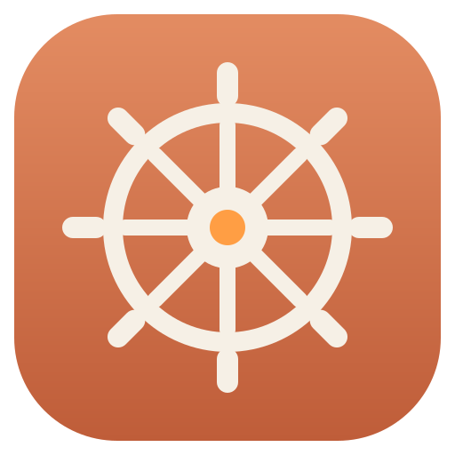

<p align="center"></p>

# Deckhand

A little desk display and remote for Claude Code — the crew member who keeps
lookout and relays your orders. Built on an ELEGOO 2.8" ESP32 touchscreen
module, with optional battery and speaker. It shows live plan usage and
per-project session status, beeps when a session needs you, and lets you
answer permission prompts, questions, and plan approvals right from the
device. Three tabs:

- **USAGE** — real plan-quota percentage for the current 5-hour session
  window and the current 7-day (weekly, all models) window. Each card has a
  reset countdown plus the wall-clock reset time ("at 14:32"), token counts,
  and a **pace tick** on the bar: a small white marker at the fraction of
  the window that has elapsed, so fill ahead of the tick = burning quota
  faster than time is passing. The weekly card also shows Fable's own
  weekly cap ("Fable: 9%").
- **SESSIONS** — which Claude Code projects are currently running on this
  Mac and whether each needs you. Rows stretch to fill the screen when
  you're monitoring only a few projects. Status is a pill whose weight
  matches urgency: solid **NEEDS INPUT** (permission prompt, question, or
  plan approval — Claude is blocked on you), outlined **READY** (turn
  finished), boxless dim **WORKING** (no attention needed). Each row shows
  model + git branch and a live "in this state for 3m" duration. With more
  sessions than fit, the six most urgent are shown and a "+N more" strip
  admits to the rest (a hidden needs-input session is called out loudly).
  Tap a row for a detail screen — and **if the session is waiting on a
  prompt, the detail screen is an answer screen**: see below.
- **SETUP** — device status and controls: Bluetooth/USB connection state
  (from the device's own perspective — more trustworthy than macOS's
  Bluetooth settings panel, which can say "not connected" for a live link),
  battery % and voltage, brightness and sleep-timeout steppers, a sound
  on/off toggle, and a touch-recalibration button.

A persistent footer on every tab shows a live clock, a battery pill
(fill level + `chg`/`full`/`%`), and "Xs ago" data freshness, so the
inherent polling delay is always visible rather than hidden.

The device **double-beeps whenever a session transitions into "needs
input"** — the point of the whole build: you find out a session is blocked
on you without checking windows. It beeps at most 3 times per prompt (one
alert + two reminders 30s apart), then stays quiet even if the prompt sits
unanswered. Toggle sound with SOUND on the SETUP tab.

## Answering prompts from the device

The display is also a remote: when a session needs input, tapping its row
opens an **answer screen** showing what's being asked, and tapping an
option answers the real prompt in Claude Code.

- **Permission prompts** — "Allow Bash?" plus the actual command text ->
  Allow / Deny.
- **Questions (AskUserQuestion)** — the question and up to four option
  buttons; your choice is delivered to Claude as the user's answer.
- **Plan approvals** — a plan summary -> Approve / Keep planning.

Commands render as a code block, questions/plans as prose. Newlines are
flattened to spaces (the display font can't draw control characters). If the
detail is long, a **READ ALL** button (top-right, well clear of the decision
buttons) opens a full-screen reader with prev/next paging. After you tap an
option it fills solid ("Allow — sent"), and the screen returns to the list
once Claude moves on. If a session shows NEEDS INPUT but its prompt isn't
answerable here (it fired while the display was disconnected, or the answer
window has closed), the detail screen says "Answer this one on your Mac".

How it works underneath: the session hook publishes the prompt details and
then waits (up to 90 seconds) for an answer file before letting the normal
dialog flow continue. The device's tap travels over USB/BLE to the host,
which writes that answer file; the hook wakes and emits a real hook
decision (allow/deny/approve, or the chosen option). The hook only ever
waits when a display is actually connected — it checks a heartbeat the
host refreshes every tick — so with the device unplugged, prompts behave
exactly as stock. If you don't answer on the device within the window,
everything falls back to the normal dialog with no side effects.

## Security of the remote

Because the device can approve tool calls, the answer channel is
authenticated so that **only your paired Mac can make a decision** — a
stranger in Bluetooth range can't approve your prompts.

- **Unique name.** Each board advertises `Deckhand-XXXX` (from its MAC), so
  several units in one room don't collide, and your host connects only to
  the specific device it learned about over USB.
- **Signed answers.** The host and device share a 128-bit secret, generated
  by the host and pushed to the device **once over the trusted USB cable**
  (never over BLE). Every answer carries an HMAC over a per-prompt nonce the
  host issues, so a device that doesn't hold the secret can't forge an
  approval, and answers can't be replayed. Forged/unauthenticated answers
  are logged and dropped. The SETUP tab shows `paired` (secret provisioned)
  or `unpaired`.
- **One-time USB step.** Provisioning happens automatically whenever the
  device is on USB (which it is while flashing). A device that has only ever
  seen BLE can't be trusted to answer until you connect it via USB once.
- **Scope:** this protects the *decision* (integrity), not the
  confidentiality of the display data — the BLE link itself is unencrypted,
  so an eavesdropper in range could still read your session list and the
  prompt text. If that matters, use USB for the sensitive sessions. Full
  link encryption would need BLE bonding, which macOS + noble supports
  poorly (the reason this uses application-layer auth instead).

The secret lives in `~/.claude/deckhand-secret` (mode 600, machine-local,
never committed). Delete it to re-pair; the host regenerates one and
re-provisions over USB.

## Hardware

ELEGOO E32R28T / E32N28T — 2.8" ESP32-32E display module, 240x320 ILI9341
LCD + XPT2046 resistive touch. Talks to the Mac over **USB (CH340
USB-serial) and/or BLE** — both are always enabled on the device
simultaneously, and the host script sends to whichever are currently
connected (it's normal and expected for both to be connected at once).
Pin mapping (LCD + touch + battery ADC + audio) is documented at the top
of `firmware/deckhand_display/deckhand_display.ino`.

Optional add-ons (both plug into the board, no soldering):

- **Battery** — a 1S LiPo on the JST 1.25 battery connector (tested with a
  3000mAh cell). Charging and power switching are pure hardware: the
  board's TP4054 charges at ~290mA whenever USB-C is present, and a P-FET
  power path runs the module from the battery the moment USB is unplugged.
  The firmware reads the level through the board's divider on IO34 and
  shows it in the footer and on SETUP. Heads-up: there is no VBUS-sense
  pin, so a *data-less* wall charger displays as "on battery" even while
  the hardware is charging.
- **Speaker** — a 1W 8Ω mini speaker on the JP1 terminals, driven by the
  onboard FM8002E amplifier. Used for the needs-input beep. Volume is the
  `BEEP_DUTY` constant in the firmware.

Bluetooth is **BLE** (a custom GATT service, the Nordic UART Service
pattern), not classic Bluetooth SPP. SPP was tried first and abandoned:
macOS's classic-BT stack would silently accept writes into a connection
with no real over-the-air session, a failure mode that recurred even
after a full unpair/restart/re-pair. BLE is far more actively maintained
on macOS since it's what nearly all modern accessories use.

## Controls

- **Tabs**: tap USAGE / SESSIONS / SETUP in the top bar.
- **Session detail**: tap a session row; tap anywhere to go back.
- **Brightness / sleep timeout**: `-`/`+` steppers on SETUP (the whole
  left/right third of each card is a hit zone). Sleep = backlight off
  after 15s–5m of no touch, or OFF to never sleep; any touch wakes it
  (that touch is consumed, so it won't also press whatever is underneath).
- **Sound**: SETUP toggle; turning it on plays the beep as a speaker test.
- **Power off**: hold the **BOOT** key ~1 second. This is ESP32 deep sleep
  (a true software power-off doesn't exist): screen, backlight, CPU, and
  radio all stop, dropping from ~100–150mA to a few mA — weeks of standby
  on battery instead of hours. **Touch the screen to turn it back on.**
  (Wake is deliberately touch, not the BOOT key — GPIO0 is a strapping
  pin, and waking with it held would boot into the serial bootloader.)
  The RESET key is always a hard power-on.
- **Auto power-off on battery**: if the device runs **on battery** with no
  active session for 20 minutes, it deep-sleeps by itself to save the
  battery (touch to wake) — the same power-down as holding BOOT. It **never**
  auto-sleeps while on USB power, no matter how long it's idle. Touch or any
  active session resets the 20-minute timer. (This is separate from, and
  goes further than, the SETUP "SLEEP AFTER" backlight dimming, which only
  turns the backlight off.)
- Settings (brightness, sleep, sound, touch calibration) persist across
  reboots and reflashes.

## Quick start (macOS)

You need: a Mac with [Node.js](https://nodejs.org) (`brew install node`),
[arduino-cli](https://arduino.github.io/arduino-cli/), Claude Code, and the
ELEGOO board.

```
git clone <your-fork-url> deckhand && cd deckhand
./install.sh
```

`install.sh` copies the Claude Code hook scripts into `~/.claude/`,
registers them in `settings.json` (backing yours up and merging - it won't
clobber existing hooks), runs `npm install`, and builds `DeckhandBLE.app`
from your own Node. Then two manual steps it prints for you: flash the
firmware, and start the host. **Restart Claude Code afterwards** so it picks
up the new hooks. The detailed walk-through is under [Setup](#setup) below.

## Project layout

```
firmware/deckhand_display/deckhand_display.ino   Arduino sketch (ESP32)
firmware/User_Setup.h                    TFT_eSPI pin config for this board
host/index.mjs                           Node script (runs on your Mac)
host/build-app.sh                        builds DeckhandBLE.app from your node
host/DeckhandBLE.plist                   Info.plist template for that app
claude-hooks/                            the ~/.claude hook scripts + installer
install.sh                               one-command setup
```

The Claude Code hook scripts ship in `claude-hooks/` but *run* from
`~/.claude/` (hooks are configured per-user, not per-project); `install.sh`
puts them there. At runtime they use these per-user paths:

```
~/.claude/deckhand-statusline.mjs        statusLine hook -> ~/.claude/deckhand-rate-limits.json
~/.claude/deckhand-session-hook.mjs      session hooks   -> ~/.claude/deckhand-sessions/*.json
~/.claude/settings.json                  registers both of the above
```

## How it works

```
Claude Code hooks (any surface: terminal, desktop app, VS Code)
    |
    `-- hooks: SessionStart, UserPromptSubmit, PreToolUse, PermissionRequest,
        PostToolUse, PostToolUseFailure, Notification, Stop, SessionEnd
            -> ~/.claude/deckhand-session-hook.mjs -> ~/.claude/deckhand-sessions/<id>.json
               (for answerable prompts: publishes the question, then waits up
                to 90s for ~/.claude/deckhand-answers/<id>.json before falling
                back to the normal dialog)

host/index.mjs (device tick every 5s)
    - Anthropic OAuth usage endpoint (every 5 min)  -> real 5h/7d/Fable quota %
      (falls back to ~/.claude/deckhand-rate-limits.json, written by the
      statusLine hook, if the endpoint is unreachable)
    - ccusage blocks --active / weekly              -> token counts
    - ~/.claude/deckhand-sessions/*.json                -> per-project status + asks
    - writes /tmp/deckhand-host-alive heartbeat (gates the hook's remote wait)
    -> JSON line over USB serial AND/OR BLE - both independent, always
       attempted; sends to whichever are currently connected
    <- "ANSWER <id> <prompt> <option>" lines from the device (USB rx or BLE
       notifications) -> ~/.claude/deckhand-answers/<id>.json for the hook

deckhand_display.ino (ESP32)
    - parses each JSON line, redraws only the fields that changed
    - beeps (max 3x) when a session newly needs input
    - touchscreen for tabs/detail/answering; BOOT key for power off
```

**Quota numbers** come primarily from the same endpoint Claude Code's own
`/usage` screen uses, authenticated with the OAuth token Claude Code
stores in the macOS Keychain (read-only — the host never refreshes or
modifies the credential). This works with zero Claude sessions open and
reflects account-wide usage from every surface. The statusLine cache is
kept as a fallback since the endpoint is undocumented.

**Session status** works in every surface. The needs-input state is driven
by the `PermissionRequest` hook (fires when an allow/deny dialog appears)
plus `PreToolUse` for questions/plan approvals; the desktop app never
fires the `Notification` hook, which is why the older Notification-based
detection missed desktop permission prompts entirely.

## Setup

`./install.sh` does steps 3–5 for you; they're spelled out here for
reference and for the firmware, which is always hands-on.

1. **Prepare TFT_eSPI**: copy this board's pin config into the library:
   ```
   cp firmware/User_Setup.h "$(arduino-cli config get directories.user)/libraries/TFT_eSPI/User_Setup.h"
   ```
   You also need the `esp32:esp32` core and the `TFT_eSPI`, `ArduinoJson`,
   and `XPT2046_Touchscreen` libraries (`Preferences` / `BLEDevice` /
   `BLEServer` / `BLEUtils` / `BLE2902` ship with the esp32 core).
2. **Flash the firmware** (from this directory):
   ```
   arduino-cli compile --fqbn "esp32:esp32:esp32:PartitionScheme=huge_app" firmware/deckhand_display
   arduino-cli upload -p /dev/cu.usbserial-XXXX \
     --fqbn "esp32:esp32:esp32:UploadSpeed=115200,FlashMode=dio,FlashFreq=80,PartitionScheme=huge_app" \
     firmware/deckhand_display
   ```
   `PartitionScheme=huge_app` gives the app partition 3MB instead of the
   default 1.2MB — needed because the Bluetooth stack alone is ~700KB+;
   this project doesn't use OTA or SPIFFS, so the tradeoff is free. On
   **first boot** the screen prompts for a one-time touch calibration —
   touch the two crosshairs; it's saved to flash and survives reflashing.
3. **Register the Claude Code hooks** — these feed per-session status (and
   the statusLine quota fallback). Without them the SESSIONS tab stays empty
   and remote answering is off.
   ```
   cp claude-hooks/deckhand-*.mjs ~/.claude/
   node claude-hooks/install-hooks.mjs   # backs up + merges into settings.json
   ```
   Then **restart Claude Code** so it reloads `settings.json`.
4. **Install host dependencies**: `cd host && npm install`.
5. **Build and run the host — via `DeckhandBLE.app`, not plain `node`, if you
   want Bluetooth**:
   ```
   host/build-app.sh            # builds the bundle from your node (one-time)
   open host/DeckhandBLE.app --args "$(pwd)/host/index.mjs"
   ```
   The bundle is required, not optional, for BLE — see
   [Why an app bundle?](#why-an-app-bundle) below. Click **Allow** the first
   time macOS asks for Bluetooth, and **Always Allow** if the Keychain asks
   about reading the Claude Code credential (that's the quota polling).
   No manual Bluetooth pairing is needed — the host scans for a device named
   "Deckhand" and connects directly.

   USB-only and don't need Bluetooth? Just `node host/index.mjs` — the BLE
   half fails silently and USB is unaffected (the two transports are
   independent).

## Why an app bundle?

On macOS, a bare `node` process is **killed outright** — no permission
prompt, just an instant crash — the moment it touches Bluetooth, because it
has no `Info.plist` declaring `NSBluetoothAlwaysUsageDescription`.
`DeckhandBLE.app` is a minimal wrapper whose executable *is* a copy of your
`node` (plus any `libnode.*.dylib` it links), with an `Info.plist` that
declares the Bluetooth usage string — so macOS shows a normal permission
dialog instead of crashing. `host/build-app.sh` assembles it from your own
node, which is why the built bundle isn't committed to git (it's ~200MB and
machine-specific).

**Does the signature expire? Do I need to re-sign every 7 days?** No. The
bundle is **ad-hoc signed** (`codesign --sign -`), and ad-hoc signatures do
**not** expire — there is no clock on them. (The 7-day expiry you may be
thinking of applies to *free Apple Developer provisioning profiles* for
sideloaded **iOS** apps — a completely different mechanism that doesn't apply
here.) You only re-run `build-app.sh` when the bundle's contents actually
change: after `brew upgrade node` (to refresh the embedded copy), or if you
edit the plist. Nothing needs doing on a schedule.

Two things *do* invalidate a bundle and need a rebuild/re-sign, for
completeness: editing any file *inside* `DeckhandBLE.app` by hand (breaks the
seal), and — if you download the repo as a zip rather than `git clone` — the
macOS quarantine flag, cleared with
`xattr -dr com.apple.quarantine host/DeckhandBLE.app`.

## Menu-bar app (optional)

If you'd rather not touch the terminal, `mac-app/` is a tiny native
menu-bar controller (Swift, macOS 13+). Build and launch it:

```
mac-app/build.sh
open mac-app/DeckhandMenuBar.app
```

It puts a ship's-wheel icon in the menu bar whose dropdown shows connection
status and quota, with **Start / Stop Deckhand**, a **Launch at login**
toggle (so it comes back after a reboot with nothing to do), and **Quit**.
It doesn't touch Bluetooth itself — it just runs and watches the same
`DeckhandBLE.app` host — so the proven transport path is unchanged. The
built app embeds this machine's repo path, so re-run `build.sh` if you move
the repo. Ad-hoc signed; `SMAppService` may need the app in `/Applications`
to self-register as a login item.

## Known limitations

- **~5s delay**: the host polls every `POLL_INTERVAL_MS` (5000ms in
  `host/index.mjs`), plus whatever `ccusage`/`git` subprocess calls take.
  The footer's "Xs ago" makes this visible rather than hiding it. A
  permission prompt answered within a second or two may come and go
  between polls — the device is for prompts you *haven't* noticed.
- **The quota endpoint is undocumented** (it's what `/usage` uses); if it
  ever changes shape the host just falls back to the statusLine cache. It
  also rate-limits bursts — the host polls every 5 min and backs off 15
  min on HTTP 429. If the Mac goes weeks with no Claude Code use at all,
  the Keychain token can expire; opening any Claude Code surface once
  refreshes it.
- **Remote answering has a 90s window** per prompt (the hook can't wait
  forever), shows up to ~400 characters of detail (tap READ ALL for a
  full-screen reader with prev/next), and doesn't support multi-select
  questions. Question answers reach Claude as a "user already answered: X"
  hook message rather than a native picker selection — functionally
  equivalent. Answering is authenticated (see [Security](#security-of-the-remote));
  a device that hasn't been USB-provisioned with the pairing secret can't
  approve anything until you connect it via USB once.
- **Stale quota is flagged, not hidden**: if the quota numbers are older
  than 15 minutes (endpoint outage + stale cache), the USAGE cards show
  "stale 3h" in the alert color where the reset time normally sits.
- **Battery % is a voltage estimate** (no coulomb counter): it dips a few
  percent under heavy load and reads optimistic while charging. Charge
  state relies on USB *data* being present — a wall charger with no data
  shows "on battery" while silently charging fine.
- **"Off" is deep sleep**, a few mA, not a hard power cut — the CH340 and
  regulator stay powered. For true zero draw, unplug the battery. Because
  there's no VBUS-sense pin, "on USB power" is inferred from recent USB data,
  so a *data-less* wall charger counts as "on battery" for the 20-minute
  auto-sleep — plugged into your Mac (data flowing) it never auto-sleeps.
- **Touch calibration** is a simple 2-point linear mapping. If it ever
  feels wrong after a firmware change, tap CALIBRATE on the SETUP tab, or
  send `RECAL` via the trigger file
  (`echo "RECAL" > ~/.claude/deckhand-device-command`) — never by opening a
  new USB connection, which resets the board via the CH340's RTS line.
- **`TOUCH_SWAP_XY`** in the `.ino` exists because this board's touch
  controller has swapped axes relative to the display; it's already set
  correctly for this exact board, but is there as an escape hatch if a
  differently-wired unit needs it flipped back.
- **BLE scan is name-based, not UUID-based**: our 128-bit service UUID
  usually doesn't fit in the 31-byte primary BLE advertisement alongside
  anything else, so the host scans for all devices and matches by the
  advertised name "Deckhand" instead of filtering by service UUID.
- **`DeckhandBLE.app` is tied to the current Homebrew node install**: it
  contains a literal copy of `node` and `libnode.147.dylib`. If you
  `brew upgrade node`, re-copy both files into
  `host/DeckhandBLE.app/Contents/MacOS/` and re-run
  `codesign --force --deep --sign - host/DeckhandBLE.app`, or the bundled
  copy will just be stale (not broken, but won't get upgrades/fixes).
- **If Bluetooth permission ever gets stuck** (macOS crashes the process
  again after previously working), reset the cached TCC decision with
  `tccutil reset BluetoothAlways com.deckhand.ble-host` and relaunch via
  `open` so it prompts again.

---

*Rumor has it something small and orange lives beneath the footer.*
