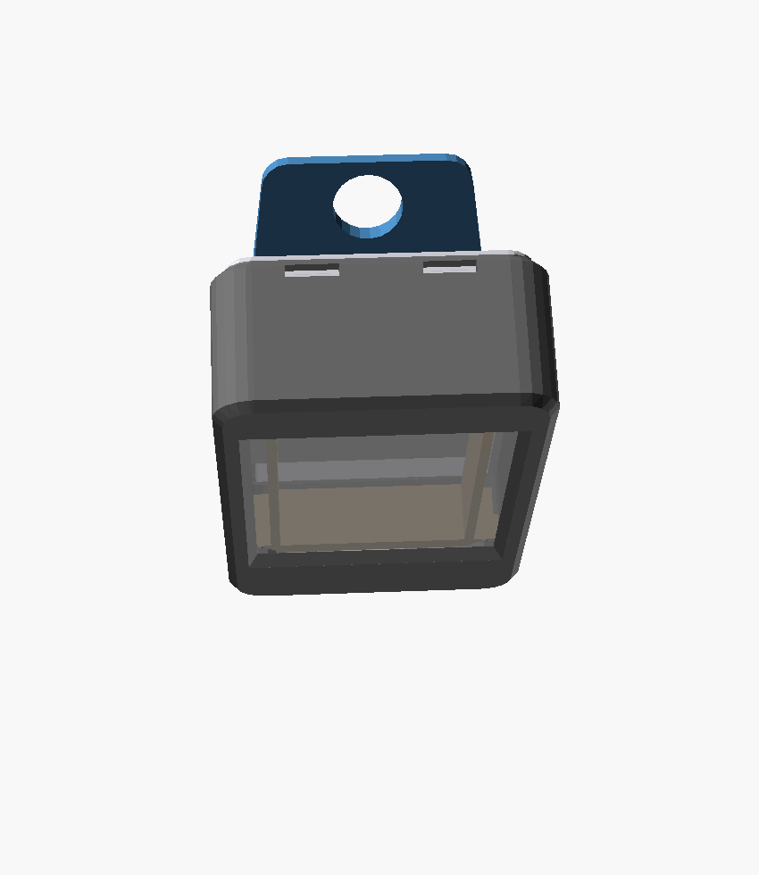

# Deckhand — 3D-printed case

A pocketable enclosure for the ESP32-2432S028 ("CYD") 2.8" board, a 3000 mAh
LiPo, and a small speaker. ~56 × 92 × 27 mm (board 51 × 86; window = the
~44 × 58 active area, shifted a few mm away from the USB-C end so the black
glass border stays hidden).



## How it mounts (the important part)

The **body** (front) has **4 posts** aligned to the board's **4 corner mounting
holes**, built the way a typical CYD carrier does it: each is a Ø7
cylinder rising to the board's **front face** (the shoulder the board rests on),
topped by a Ø`pin_d` **locating pin** that passes up through the mounting hole
and finishes flush with the board's back.

The board drops in screen-first and the four pins engage its holes. At the
default `pin_d` (1.3) they're sized as **assembly guides** — they drop the board
straight onto its footprint and stop it rotating, while the **cavity walls**
(±0.5 mm) do the fine locating. That's deliberate: four rigid pins must all
engage at once, so a tight fit binds on normal print error (see `pin_d` under
Tuning). **No screws or nuts needed** for the board; the retainer above holds it
down. The board is held only at its 4 mounting holes — flat PCB — so uneven
component height doesn't matter.

The **battery** lies on the back of the board in the cavity behind it. The
**back cover snaps on** (barbed lip into slots in the walls) — no screws
through the back.

USB-C exits the **top** edge; RESET/BOOT are back-face access holes.

## Parts

| File | What | Qty | Print orientation |
|------|------|-----|-------------------|
| `stl/deckhand_body.stl`     | Front body: window, 4 posts + locating pins, walls, cutouts | 1 | **front face down** |
| `stl/deckhand_retainer.stl` | Battery + speaker retainer — **drop-in insert** | 1 | flat (walls up) |
| `stl/deckhand_cover.stl`    | Back cover (snaps on) + hinge bosses | 1 | **bosses up** (light support under the plate) |
| `stl/deckhand_stand.stl`    | **Fold-out kickstand blade** — pivots on the cover | 1 | flat (nose up) |

PLA/PETG, 0.2 mm, 3 perimeters, 20–30 % infill. Body, retainer, and leaf need
**no supports**. The cover prints bosses-up; it's a snap-lid with the hinge on the
*outside* (features on both faces), so give the plate a little support underneath.

## Why the retainer is separate

The battery/speaker corral has to start at the board's *back plane*, so if it
were part of the body it would **float** in mid-cavity — unsupported, hard to
print, fragile. Making it a **separate flat insert** solves that: it prints on
its own with all walls vertical (no support), then drops into the cavity.

The battery corral is an **open ring — no floor**. That's deliberate: the pack
nestles straight *down* onto the board's low centre components. (An earlier
solid-floor version bridged the tall ~6 mm edge JST connectors and rode up on
them, sitting proud of the walls and jamming the cover shut.)

It's located by two full-width **end caps** that reach the body's top, bottom,
and side walls in the header-free strips at each end — a **loose drop-in fit**
(no fiddly press-fit into the body), yet it can't slide around. The whole insert
is trimmed to the **cavity's rounded profile** (its corners match the body's
corner radius, inset by `fit`) — square corners jam on those radii and stop it
seating.

Each end cap also carries **end walls**, level with the battery corral wall
(`retainer_h`) so **nothing on the insert stands proud** — they ride against the
body walls over that full height, which stops it tilting. They're split either
side of centre to clear the USB-C connector. They were once taller, reaching
into the cover lip's footprint to trap the retainer, but that propped the cover
open so its barbs never fully seated — hence the loose cover. The caps are
flat panels, so they double as a big first-layer footprint for bed adhesion and
tie the thin corral walls together. They're short (5 mm) and sit well below the
cover's lip, so the cover closes cleanly over the whole insert. The speaker
pocket is **also open-bottomed** (its floor is cut through the bottom cap) so
the speaker rests directly on the board, same as the battery. **Wire grooves**
are cut at board level from the speaker pocket out to the clear gap beside the
corral on **both sides**, so the speaker lead runs flush to the board's connector
whichever side it's on, instead of being pinched over the walls (`wire_w`/
`wire_h` size them). Prints flat, **no supports** (a slicer brim helps the long
corral walls stick). Tune `retainer_h`, `cap_h`, or `fit`.

## The stand folds out (it stays on the device)

A **barrel hinge**. The cover carries two low **bosses** on the hinge line; the
kickstand is a tapered **blade** whose full-width rounded **nose** runs across
them, notched to clear each boss — so the blade grips each boss on *both* sides
(no side play) and the hinge line reads as **one continuous barrel**, not
mismatched lumps.

Everything on the hinge is the same `ks_barrel` diameter and the axis sits at
exactly `ks_barrel/2`, so the nose is **tangent to the cover**: the blade folds
**flush** and sweeps out without ever touching the cover. The whole hinge stands
8.2 mm off the back.

The screw heads are **hidden**: each blade end is counterbored so an M3 socket-cap
head sits just below flush, leaving a 1.2 mm rim. That rim is what sets the
barrel at 8.2 mm — at 7.0 the rim would be 0.6 mm and would crack.

One **M3 × 10 cap screw per side** threads straight into its boss (the plastic
takes the thread) and clamps the blade — that sets the friction that holds any
angle. **No captive nut:** a nut is 6.5 mm across corners, and housing one is
what forced the old 9 mm knuckle and all the bulk. Dropping it is what let the
barrel shrink and the two halves match.

It **prints flat, blade-down, no support**: the hull gives one flat underside on
the bed (the nose is tangent to that plane, never below it), the taper is all
shallow overhang, and the bore is a **teardrop** so its top is a self-supporting
point rather than a ceiling that sags into strings.

## The microphone (MAX4466 on the Expand connector)

The electret amp module stands **on edge in the retainer**, against the **same
side wall its cable plugs into** — the wall with the board's *Expand* header. Two
gaps are cut into that wall's inner face, both **full-height vertical channels**
rather than blind pockets, because the retainer drops in **vertically** and a
blind pocket has nothing to drop into:

- **Expand-cable relief** (`exp_*`) — the plug plus its DuPont shells stand ~1.5 mm
  proud of the header; this channel gives them somewhere to go.
- **Mic channel** (`mic_relief`) — 1.8 mm deep over the module's footprint. It
  earns its keep twice: it buys 1.8 mm of clearance from the battery, and the
  capsule *bottoms in it*, so the wall is what stops the module leaning outward.
  A **Ø5 sound port** pierces the 0.8 mm of wall left outboard, on the capsule's
  axis. The wall becomes a short acoustic channel, which an electret is perfectly
  happy with.

It sits near the **USB-C end**, because that is the only stretch of that long
edge with nothing to foul — the board's SPEAKER/SPI/Expand JSTs all live in the
far half. The **pads face the other way** (back toward the Expand connector) so
the cable run is as short as this layout allows, and the **battery is shifted**
`batt_dx` away from that wall to make the strip.

The slot is sized for a **~3 mm** board, not the bare 1.6 mm of FR4 — the trimmed
pins and solder on its back face go into the slot too. That thickness drives the
whole X chain, so widening it moves the module inboard by the same amount: the
pad-end joints now clear the battery corral by **1.0 mm** rather than 2.4 mm. Set
`mic_t` to whatever your module actually measures and the rest follows.

The mount is a **walled room the module sits in** — the same construction as the
speaker pocket, and for the same reasons: a ring of walls, **open at the bottom** so
the contents rest straight on the board's back face, capped by a **plate at the top**.
Nothing grips the mic. It drops into the room, the plate's slot locates it upright,
and the board's own back face floors it.

The room is sized to the module's **whole footprint, solder joints included** (0.4 mm
of clearance all round). That is what lets the inner wall run straight for the full
length: earlier revisions had to step around the ~2.8 mm of solder standing proud of
the board's inner face at the pad end, which produced a stub that was neither use nor
ornament. The room's inner wall overlaps the battery corral, which is both how it is
tied into the insert and why it needs no separate gusset.

**Nothing rises above `retainer_h`.** Two things follow from that:

- **The board pokes through the plate** — it stands 13.8 mm on the PCB and the cap is
  11.7, so the plate is slotted. The slot is cut only over the board's own length, so
  the end walls keep their full tops, and it is what locates the board across the room.
- **The outer wall carries a window** for the capsule, which overhangs the board's
  outer face by 5.4 mm across the middle 10 mm of its length and up to z 11.9 — nearly
  the full wall height. Its top edge bridges like any printed doorway.

Because the mount stays under the cover lip's z entirely, the lip is no longer a
constraint on it at all.

### Wiring it

Three wires, into the board's 4-pin **Expand** connector:

| module pad | goes to |
|---|---|
| `VCC` | **3.3 V — never 5 V** |
| `GND` | GND |
| `OUT` | **IO35** |

**Meter the connector before you plug the module in.** Identify 3.3 V and GND from
the header's own silkscreen and confirm with a meter; the remaining signal pin is
IO35. The physical pin *order* is deliberately not recorded here, because getting
it wrong has a nasty failure mode: reverse polarity makes the module conduct
through its ESD diodes and drag the 3.3 V rail, so the board **won't boot and
looks exactly like bricked firmware** — dark screen, no serial output, while
esptool still talks to the chip happily. Unplug the module and it boots.

**Never power it from 5 V** even though the module accepts 2.4–5.5 V: IO35 is not
5 V tolerant, and at 5 V the op-amp biases at 2.5 V and swings toward 5 V, past
the pin's absolute maximum.

To check the wiring, tap **SETTINGS › ACTIONS › MIC TEST** on the device. A working
module idles at **~1.65 V** (DC bias ~1893 counts); a reading pinned near 0 means
`OUT` isn't connected or the module has no power. Set the gain with the same meter
screen — aim for a floor of **~100–150** when silent (~35 means barely any gain,
~750 means the amp is oscillating). See CLAUDE.md for the firmware side.

## Where things go inside (depths)

Important: the **4 posts are in FRONT of the board** — they hold it up off the
front face. The **battery and speaker sit BEHIND the board**, in the cavity. So
the posts never collide with the battery/speaker (different depths); any
overlap you see in a flat top view is just the projection.

- **Battery:** on the back of the board, pushed toward the USB-C end, and offset
  `batt_dx` away from the Expand-side wall to leave the microphone strip.
- **Microphone:** on edge against the Expand-side wall, near the USB-C end (see
  above).
- **Speaker (17×10×4 mm):** in the cleared strip at the **end opposite USB-C**,
  centred. It's on an 85 mm lead and only 4 mm thick, so it's flexible — if your
  board has a tall part there, move it with `spk_cx` / `spk_cy` (or just let it
  rest in any gap). The battery is long (68 mm) and nearly fills the board, so
  that end strip is the main clear spot.

## Hardware

| Item | Qty | Where |
|------|-----|-------|
| M3 × 10 hex-socket cap screw | 2 | kickstand pivots — one per side, threads into its boss (head sits recessed) |

That's the **only** hardware — two screws, no nuts. The board is located by the
body's 4 moulded pins, and the cover snaps onto the body.

## Assembly

1. Drop the **board** in **screen-first** — the 4 posts' **locating pins** enter
   its mounting holes and it settles onto the shoulders. It should sit flat with
   no play; if the pins are tight, ease `pin_d` down slightly.
2. Wire up the battery (BAT) and speaker.
3. **Drop the retainer** into the cavity — it just sits in, located by its end
   caps against the walls (no press-fit). Set the **speaker** into its pocket
   and drop the **battery** into the open corral (it rests on the board).
4. **Microphone** (if fitted): plug its cable into *Expand* first — the header is
   buried once the module is in — then push the module down between the pillars,
   capsule-first toward the wall, past both pinch bumps, until it rests on the
   board. The capsule should sit in the wall channel with the sound port centred on
   it. Route the cable down the strip and through the Expand relief. Check it with
   **SETTINGS › ACTIONS › MIC TEST** before closing the cover.
5. **Snap the cover on** — press until the barbs click into the wall slots. It
   should feel tight with no rattle; if it's stiff, raise `g` in `cover()`, and
   if it's loose, lower `g` or deepen the barb's catch shelf.
6. **Kickstand:** sit the blade's notches over the cover's two bosses, then run an
   **M3 × 10** hex-socket cap screw into each outer edge — it drops into the
   counterbore and threads into the boss. Tighten until the blade holds any angle
   but still folds; the head finishes below flush.

## Tuning (`deckhand_case.scad`)

Measure your board and set:

- `board_w`, `board_h` — **the critical pair.** Everything downstream (cavity,
  columns, window, USB-C wall, battery, retainer, cover) derives from them, so
  correcting one fixes the whole case. Measured 51 × **86** here; at 87 the
  cavity ran ~1 mm long, the board rattled, and the columns sat off the holes.
- `hole_ins` — inset of the 4 corner holes (must match, or the posts won't line
  up with your board).
- `clr` / `clr_w` — board-to-wall clearance along the length / the sides. `clr_w`
  is 0 (snug sides); raise to 0.1–0.15 if the board won't drop in, lower nothing
  further.
- `pin_d` — pin diameter, **1.3** for a ~3.2 mm hole. All 4 pins engage at once,
  so pin-*spacing* error eats the clearance: typical FDM error over the 78.8 mm
  span (~0.3 %) is ~0.24 mm, and small pins print ~0.15 mm oversize. A "snug"
  2.9 tolerates only 0.10 % and would bind; 1.3 tolerates 1.1 %, so it always
  seats. Trade-off: at 1.3 the pins guide rather than locate (±0.88 mm play, vs
  ±0.5 mm from the walls). Raise toward **2.6** (±0.23 mm, tolerates 0.29 %) if
  you want the pins to do the locating and your printer is well calibrated.
  `pin_lead` is the tip taper that helps the board drop on.
- `col_d` — diameter of the shoulder the board rests on.
- `usb_dx`, `usb_w`, `usb_h` — USB-C opening on the top edge (sized generously
  for a cable overmold/handle; shrink if you want it tighter). `usb_cham` /
  `usb_cham_d` flare the outer opening into a funnel so the plug guides in.
- `reset_dx`, `boot_dx`, `btn_in` — the two back button holes.
- `win_w`, `win_h`, `win_shift` — display window. **`win_shift`** slides it
  away from the USB-C end; increase it if a black glass edge still shows on the
  USB-C side.
- `win_cham` — chamfer that flares the window's top edge outward (2.0 mm) so a
  fingertip can reach the screen's edge instead of hitting a vertical lip.
  Bigger = easier edge touches but exposes a little more of the black border on
  the bevel; 0 for a square opening.
- `mic_*` — the microphone mount. `mic_l`/`mic_w`/`mic_t` are the module's PCB —
  **`mic_t` is the board's real thickness (~3 mm), not the bare FR4** —
  `mic_can_d`/`mic_can_h` its capsule, `mic_under` the solder joints on the back
  face. `mic_y0` slides it along the wall (raise it toward the USB-C end; it is
  bounded by the retainer's top end cap at local Y 82.5). `mic_gap` is the
  clearance round the module inside the room (0.4 all round). It is a **fit, not a
  grip** — nothing should have to be forced in.
  `mic_floor` is 0 so the module rests on the board, `mic_roof_t` is the top plate's
  thickness (its top face *is* `retainer_h`), and `mic_win_pad` is the clearance round
  the capsule's window.
  `mic_relief` is
  the wall channel depth and `mic_can_gap` the air left in front of the capsule.
  `mic_port_d` is the sound port. Set `mic_relief = 0` and delete the slot if you
  are building without a mic.
- `exp_side`, `exp_from_far`, `exp_w`, `exp_relief` — the Expand-cable channel.
  **`exp_side` is easy to get backwards:** a photo of the board's *back* mirrors X
  relative to this model, which is front-referenced. +1 is the wall the Expand
  header is actually on.
- `batt_dx` — shifts the pack away from the Expand-side wall to make room for the
  microphone. Set it to 0 to re-centre the pack if you skip the mic.
- `comp_back`, `batt_seat`, `batt_extra` — clearances behind the board.
  `batt_extra` sets the depth margin so the cover closes; reduce it to slim the
  case if your pack + components allow.

Re-export:

```
cd case
for p in body retainer cover stand; do openscad -o stl/deckhand_$p.stl -D "part=\"$p\"" deckhand_case.scad; done
```

When you change anything in the cavity, **probe it** rather than eyeballing the
preview. `part="none"` renders nothing on purpose, so an `include`-based probe
can intersect two things and ask whether the result is empty:

```
printf 'include <deckhand_case.scad>\nintersection(){ mic_module(); body(); }\n' > /tmp/p.scad
rm -f /tmp/p.stl && openscad -o /tmp/p.stl -D 'part="none"' /tmp/p.scad; test -s /tmp/p.stl && echo COLLISION || echo clear
```

Three traps, all of which produced a wrong answer here: `include` re-runs the
part dispatch (hence the `none` branch — without it every probe silently unioned
the whole assembly in and reported a collision); `use` imports modules but **not
variables**, so coordinates come out `undef` and land at the origin; and
OpenSCAD **does not hoist**, so referencing a variable defined further down the
file is a silent `undef` too. Coincident faces also read as a "collision" — check
the result's bounding box, and if one axis is a single value it is a
zero-thickness sheet, i.e. two surfaces touching, not real interference.

> **Print the body first as a fit check** — confirm the 4 locating pins drop
> into your board's holes and the window frames the screen before final prints.
> The snap fit may need a tweak (`cover.lip_in` / barb size) after a test.
